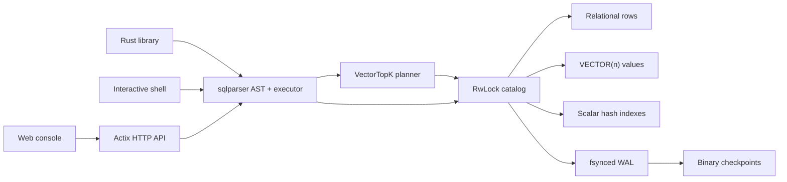

<p align="center">
  
</p>

<p align="center">
  <a href="https://github.com/kamilsj/vectors/actions/workflows/ci.yml"></a>
  <a href="https://github.com/kamilsj/vectors/stargazers"></a>
  
</p>

<p align="center">
  <strong>An embeddable vector database where relational data and embeddings share one query language: SQL.</strong>
</p>

<p align="center">
  Rust 2021 · SQL parser · exact vector search · Actix Web · durable WAL
</p>

<p align="center">
  <a href="#try-it-in-two-minutes">Quickstart</a> ·
  <a href="docs/BENCHMARKS.md">Benchmarks</a> ·
  <a href="docs/ARCHITECTURE.md">Architecture</a> ·
  <a href="ROADMAP.md">Roadmap</a> ·
  <a href="CONTRIBUTING.md">Contributing</a>
</p>

---

`vectors` is a lightweight database engine for applications that need metadata
filters and vector similarity in the same query. Define `VECTOR(n)` columns,
insert embeddings beside normal relational values, and search both without
introducing a second query language or a separate metadata store.

```sql
SELECT id, title,
       cosine_distance(embedding, ARRAY[1, 0, 0]) AS distance
FROM documents
WHERE category = 'tech'
ORDER BY distance
LIMIT 5;
```

> **Project status:** `vectors` is pre-1.0 and designed for prototypes, local
> tools, tests, and small embedded workloads. It is not yet a replacement for a
> distributed or replicated production database.

## Install and launch

The installers verify the release archive checksum, install both binaries for
the current user, add the install directory to future shell sessions, start the
server with durable storage enabled, and open the web console when a desktop is
available.

Linux x86-64:

```sh
curl --proto '=https' --tlsv1.2 -LsSf \
  https://github.com/kamilsj/vectors/releases/latest/download/install.sh | sh
```

Windows x86-64 PowerShell:

```powershell
& ([scriptblock]::Create((irm 'https://github.com/kamilsj/vectors/releases/latest/download/install.ps1')))
```

The console opens at [http://127.0.0.1:8080](http://127.0.0.1:8080). Pass
`--no-start` to the Linux script or `-NoStart` to PowerShell for an install-only
run. Both scripts support a fixed release version and custom install directory;
save the script locally and run `./install.sh --help` or
`Get-Help .\install.ps1 -Full` before execution if you want to inspect or
customize it. A scheduled GitHub Actions smoke test installs the latest public
release, starts it, and checks the health endpoint on both operating systems.
Upgrading from 0.2 reuses the existing `vectors.vdb` as the first durable
checkpoint and begins logging subsequent writes; no export step is required.

If port 8080 is already occupied, choose another address during installation:

```sh
curl --proto '=https' --tlsv1.2 -LsSf \
  https://github.com/kamilsj/vectors/releases/latest/download/install.sh | \
  sh -s -- --bind 127.0.0.1:8081
```

```powershell
& ([scriptblock]::Create((irm 'https://github.com/kamilsj/vectors/releases/latest/download/install.ps1'))) -BindAddress '127.0.0.1:8081'
```

## Why vectors?

- **SQL first.** Create schemas, filter metadata, aggregate rows, upsert data,
  and rank vectors with familiar SQL.
- **Schema-aware intent.** Analyze a `SELECT` before execution, expand `*`, and
  identify keys, content, attributes, embeddings, aggregates, and similarity
  scores, including `DISTINCT`, grouping, and `HAVING` semantics.
- **Self-describing results.** Every query response carries declared SQL types
  even when the result is empty or contains only `NULL` values; expression type
  errors are rejected before scanning rows.
- **Hybrid by default.** Scalar hash indexes prune relational candidates before
  exact vector distance evaluation.
- **Rust all the way down.** Memory-safe engine code, immutable vector values,
  cached norms, and SIMD-friendly distance loops.
- **Low repeat-query overhead.** Cloned handles share a bounded SQL AST cache;
  schema checks still run against the current catalog on every execution.
- **Direct typed ingestion.** JSON and Rust values enter the shared atomic
  insert core without being serialized into SQL literals and parsed again.
- **Incremental scalar indexes.** Append-only batches add hash buckets for new
  rows without rescanning the existing table.
- **Indexed uniqueness.** Primary-key and `UNIQUE` checks use maintained key
  maps, making idempotent batch replay independent of existing table scans.
- **One binary, three interfaces.** Embed the library, use the interactive
  shell, or run the Actix HTTP server with its built-in web console.
- **Durable by default.** A checksummed, fsynced write-ahead log protects every
  acknowledged write; compact binary checkpoints keep recovery bounded.
- **No frontend toolchain.** The console ships inside the server with no CDN,
  Node runtime, or asset build required.

## Fast path for SQL vector search

The planner recognizes the common exact-search shape:

```sql
SELECT id, title,
       cosine_distance(embedding, ARRAY[1, 0, 0]) AS distance
FROM documents
WHERE category = 'tech'
ORDER BY distance
LIMIT 20;
```

For safe projections, this becomes a specialized `VectorTopK` plan:

1. scalar hash indexes prune relational candidates;
2. the query vector is evaluated once rather than once per row;
3. distance functions call the vector kernels directly, bypassing generic AST
   evaluation;
4. large scans are scored in parallel with thread-local bounded heaps;
5. text, vectors, and other projected values are cloned only for final winners.

Queries with additional sort keys, `DISTINCT`, or complex projections fall back
to the general SQL executor without changing their semantics. Use `EXPLAIN` to
see whether a statement selected `VectorTopK`.

WAL writes are sequential and typed embedding batches store vectors as compact
binary `f32` values rather than SQL text. Checkpoint I/O uses 1 MiB sequential
buffers and encodes or decodes each vector in one contiguous operation. The
format remains backward compatible and entirely safe Rust—no memory mapping or
unsafe borrowed file pages.

Run the reproducible local benchmark:

```sh
cargo run --release --example benchmark_vector_search
```

On the development machine, the median 10,000-row × 64-dimension filtered
cosine query took 0.49 ms through `VectorTopK` versus 12.90 ms through the
generic plan (26.2× faster in-engine). Reusing its parsed AST was 1.20× faster
than parsing otherwise identical SQL. Treat these numbers as a regression
baseline, not a cross-database benchmark; hardware and workloads matter. The
exact method, environment controls, and reporting rules are in [the benchmark
guide](docs/BENCHMARKS.md).

The durable-storage harness sustained about 351,000 rows/s for ten fsynced
1,000-row × 64-dimension typed batches, then recovered its 2.73 MiB WAL in
11.56 ms. These are embedded-path regression numbers from the same development
machine; transaction size and storage hardware materially change the result.

## Try it in two minutes

### 1. Start the web console

```sh
cargo run --release --bin vectors-server -- --data-dir ./vectors-data
```

Open [http://127.0.0.1:8080](http://127.0.0.1:8080). The console includes:

- a multiline SQL editor with ready-to-run examples;
- schema-aware **Understand query** analysis before execution;
- live table, schema, index, row-count, and revision navigation;
- a guided structured vector-search builder;
- relational filters, selectable distance metrics, and ranked result tables;
- optional bearer-token authentication stored only in the browser tab.

Click **Run query** on the default quickstart, select the new `documents` table,
then open **Search vectors**.

### 2. Or use the shell

```sh
cargo run --release --bin vectors
```

```text
vectors 0.5.0 | in-memory SQL vector database
Type .help for help. End SQL with ';'.
vectors>
```

Pass `--data-dir ./vectors-data` to make shell writes durable. The shell provides
`.tables`, `.schema`, `.indexes`, `.checkpoint`, `.read`, `.save`, `.open`,
`.timer`, and multiline cancellation commands.

### 3. Or embed the engine

```rust
use vectors::Database;

let database = Database::open_persistent("./vectors-data")?;
database.execute(
    "CREATE TABLE points (id INTEGER PRIMARY KEY, label TEXT, v VECTOR(2))"
)?;
database.execute(
    "INSERT INTO points VALUES (1, 'origin-ish', ARRAY[0.1, 0.2])"
)?;

let result = database.execute(
    "SELECT id, label, l2_distance(v, ARRAY[0, 0]) AS distance
     FROM points ORDER BY distance LIMIT 10"
)?;

database.checkpoint()?;
# let _ = result;
# Ok::<(), vectors::Error>(())
```

Applications that already have typed values can bypass SQL literal generation:

```rust
use vectors::{Database, InsertConflict, Value, Vector};

# let database = Database::new();
# database.execute("CREATE TABLE points (id INTEGER PRIMARY KEY, label TEXT, v VECTOR(2))")?;
database.insert_rows(
    "points",
    vec![vec![
        Value::Integer(2),
        Value::Text("second".into()),
        Value::Vector(Vector::new(vec![0.2, 0.8])?),
    ]],
    InsertConflict::Fail,
)?;
# Ok::<(), vectors::Error>(())
```

See [`examples/hybrid_search.rs`](examples/hybrid_search.rs) for a complete
program and [`examples/benchmark_vector_search.rs`](examples/benchmark_vector_search.rs)
for the reproducible performance harness.

## A deliberately small architecture



The active working set lives in memory. Cloned `Database` handles share one
catalog: readers may execute concurrently while writes are serialized. Durable
writes are staged, appended to the WAL, synchronized, and only then published
to readers. A multi-statement request commits as one unit or leaves both memory
and durable state unchanged.

## SQL and vector features

| Area | Supported |
| --- | --- |
| Schema | `CREATE/DROP TABLE`, single-column `PRIMARY KEY` and `UNIQUE` |
| Indexes | `CREATE/DROP INDEX`, scalar hash indexes |
| Writes | multi-row `INSERT`, `UPDATE`, `DELETE`, atomic statement batches |
| Upserts | `ON CONFLICT DO NOTHING`, `DO UPDATE`, `excluded.column`, optional `WHERE` |
| Queries | aliases, `DISTINCT`, `WHERE`, `ORDER BY`, `LIMIT`, `OFFSET` |
| Aggregates | `COUNT`, `SUM`, `AVG`, `MIN`, `MAX`, `DISTINCT`, `GROUP BY`, `HAVING` |
| Expressions | arithmetic, comparisons, boolean logic, `NULL`, `BETWEEN`, `IN`, `LIKE`, `ILIKE` |
| Planning | `EXPLAIN`, hash-index pruning, bounded top-k execution |
| Fast search | direct distance scoring, deferred projection, parallel top-k heaps |
| Types | integers, floating point, decimals, text, booleans, fixed-width `VECTOR(n)` |

Vector literals can be written as `ARRAY[1, 2, 3]` or `VECTOR(1, 2, 3)`.

### Distance and vector functions

- `cosine_distance(a, b)`
- `l2_distance(a, b)` / `euclidean_distance(a, b)`
- `squared_l2_distance(a, b)`
- `dot_product(a, b)` / `inner_product(a, b)`
- `vector_dims(v)` / `dimensions(v)`
- `vector_norm(v)` / `norm(v)`
- `normalize(v)` / `normalize_vector(v)`

## HTTP API

The server binds to `127.0.0.1:8080` by default.

| Method | Endpoint | Purpose |
| --- | --- | --- |
| `GET` | `/` | Web console |
| `GET` | `/healthz` | Public health, version, and storage-mode metadata |
| `POST` | `/v1/sql` | Execute one or more SQL statements |
| `POST` | `/v1/sql/intent` | Validate and explain one read-only `SELECT` |
| `GET` | `/v1/tables` | Table summaries and catalog revision |
| `GET` | `/v1/tables/{table}/schema` | Typed column metadata |
| `GET` | `/v1/tables/{table}/indexes` | Scalar index metadata |
| `POST` | `/v1/tables/{table}/rows` | Typed bulk ingestion and upserts |
| `POST` | `/v1/vector/search` | Structured hybrid vector search |

Run SQL:

```sh
curl http://127.0.0.1:8080/v1/sql \
  -H 'content-type: application/json' \
  -d '{"sql":"SELECT id, title FROM documents ORDER BY id"}'
```

Each query result inside `results` keeps the simple `columns` and `rows` arrays
and adds stable typed metadata for clients that must not infer a schema from
returned values:

```json
{
  "type": "query",
  "columns": ["id", "distance"],
  "schema": [
    {"name": "id", "data_type": "INTEGER"},
    {"name": "distance", "data_type": "DOUBLE"}
  ],
  "rows": [],
  "row_count": 0,
  "rows_examined": 0
}
```

Types come from schema-aware AST validation, not from the first returned row.
Invalid arithmetic, predicates, vector functions, dimensions, and sort keys
therefore fail consistently even when the source table is empty.

Understand a query without executing it:

```sh
curl http://127.0.0.1:8080/v1/sql/intent \
  -H 'content-type: application/json' \
  -d '{
    "sql":"SELECT * FROM documents WHERE category = '\''tech'\'' LIMIT 5"
  }'
```

The response expands `*` against the current schema and assigns each output a
role such as `identifier`, `content`, `attribute`, or `embedding`. Vector-ranked
queries also report the metric, vector column, dimensions, direction, and
whether the specialized `VectorTopK` path is available. Aggregate queries
report declared output types, aggregate roles, `DISTINCT`, `GROUP BY`, and
`HAVING`. The analyzer accepts exactly one `SELECT`; it never executes mutations
or invents missing schema.

Run structured hybrid search without constructing SQL in the client:

```sh
curl http://127.0.0.1:8080/v1/vector/search \
  -H 'content-type: application/json' \
  -d '{
    "table": "documents",
    "vector_column": "embedding",
    "query": [1.0, 0.0, 0.0],
    "metric": "cosine",
    "select": ["id", "title"],
    "filters": [{"column": "category", "operator": "eq", "value": "tech"}],
    "limit": 5
  }'
```

Requests are limited to 16 MiB, bulk ingestion to 1,000 rows per request, and
search results to 1,000 rows. Typed ingestion performs JSON validation on a
blocking worker and shares SQL `INSERT` constraint, conflict, revision, and
index-maintenance semantics without reparsing generated SQL.

## Server configuration

Select a local port directly from the command line:

```sh
vectors-server --data-dir ./vectors-data --port 8081
vectors-server --data-dir ./vectors-data --bind 0.0.0.0:9000
```

`--port` listens on localhost. Use `--bind` when the host address also needs to
change. Bind options override `VECTORS_BIND`, and `--data-dir` overrides
`VECTORS_DATA_DIR`; without a bind setting, the server uses `127.0.0.1:8080`.

```sh
VECTORS_BIND=127.0.0.1:9000 \
VECTORS_DATA_DIR=./vectors-data \
VECTORS_API_TOKEN=replace-with-a-long-random-token \
cargo run --release --bin vectors-server
```

| Variable | Meaning |
| --- | --- |
| `VECTORS_BIND` | Listen address when `--port` or `--bind` is not supplied; defaults to `127.0.0.1:8080` |
| `VECTORS_DATA_DIR` | Durable directory containing `vectors.wal`, `vectors.vdb`, and the process lock |
| `VECTORS_SNAPSHOT` | Legacy snapshot-only mode; mutually exclusive with `VECTORS_DATA_DIR` |
| `VECTORS_AUTOSAVE_INTERVAL_SECS` | Legacy snapshot checkpoint interval; requires `VECTORS_SNAPSHOT` |
| `VECTORS_API_TOKEN` | Requires `Authorization: Bearer …` on every `/v1` endpoint |

The console and health check remain public when authentication is enabled, but
all database API calls require the token. There is no built-in TLS or per-user
authorization; keep the default localhost bind or place the server behind a
TLS-enabled reverse proxy.

## Persistence model

`Database::open_persistent` opens or creates a data directory and obtains an
exclusive process lock. Each successful SQL write request or typed embedding
batch is validated against a private catalog, encoded as one WAL record,
checksummed, appended sequentially, and synchronized to storage before the new
catalog becomes visible. Failed validation or I/O leaves the live catalog
unchanged.

On startup, `vectors` loads `vectors.vdb` into memory and replays newer WAL
records. A torn final record is safely discarded; checksum errors, invalid
sequences, and operations that cannot be replayed stop startup rather than
silently exposing partial data. The WAL is compacted automatically after 64 MiB
and on graceful server shutdown. `Database::checkpoint` and the shell's
`.checkpoint` command trigger compaction explicitly.

Vectors remain dense contiguous `f32` values on disk and in memory. Checkpoints
use bounded decoding and 1 MiB buffered I/O, validate dimensions and finite
values before allocation, rebuild scalar indexes, and retain compatibility with
snapshot versions 1 and 2.

`Database::save` and `Database::open` remain available for portable standalone
snapshots. Snapshot saves copy a coherent catalog and perform disk I/O without
holding the catalog lock; they are backups or explicit exports, not a substitute
for WAL durability.

`Database::revision` remains an in-process change token. Durable record sequence
numbers are separate and are persisted in snapshot format version 3.

## Current limitations

- exact search only; no approximate-nearest-neighbor index yet;
- no joins, subqueries, window functions, or aggregate `FILTER` clauses;
- no explicit transaction spanning multiple HTTP requests;
- checkpoint creation currently pauses writers while the checkpoint is written;
- no replication;
- no roles, per-user authorization, or built-in TLS.

Keeping these boundaries visible is intentional: `vectors` should be easy to
understand before it becomes broad. Planned work and its acceptance criteria
are tracked in [ROADMAP.md](ROADMAP.md).

## Development

```sh
cargo fmt --all -- --check
cargo clippy --all-targets -- -D warnings
cargo test --all-targets
cargo doc --no-deps
```

CI runs formatting, linting, documentation, tests, and release builds on Linux
and Windows. See [CONTRIBUTING.md](CONTRIBUTING.md) before proposing a large SQL
or storage change. Design invariants live in
[docs/ARCHITECTURE.md](docs/ARCHITECTURE.md), performance results in
[docs/BENCHMARKS.md](docs/BENCHMARKS.md), and security reporting guidance in
[SECURITY.md](SECURITY.md).
