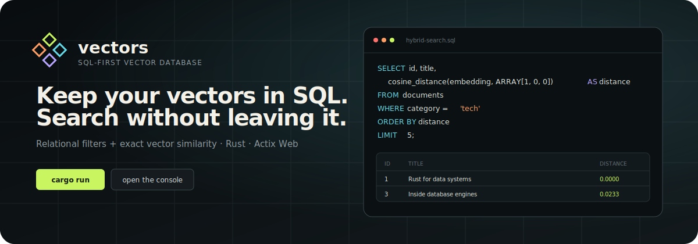
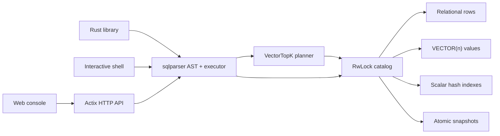

<p align="center">
  
</p>

<p align="center">
  <a href="https://github.com/kamilsj/vectors/actions/workflows/ci.yml"></a>
  <a href="https://github.com/kamilsj/vectors/stargazers"></a>
  
</p>

<p align="center">
  <strong>An embeddable vector database where relational data and embeddings share one query language: SQL.</strong>
</p>

<p align="center">
  Rust 2021 · SQL parser · exact vector search · Actix Web · atomic snapshots
</p>

<p align="center">
  <a href="#try-it-in-two-minutes">Quickstart</a> ·
  <a href="docs/BENCHMARKS.md">Benchmarks</a> ·
  <a href="docs/ARCHITECTURE.md">Architecture</a> ·
  <a href="ROADMAP.md">Roadmap</a> ·
  <a href="CONTRIBUTING.md">Contributing</a>
</p>

---

`vectors` is a lightweight database engine for applications that need metadata
filters and vector similarity in the same query. Define `VECTOR(n)` columns,
insert embeddings beside normal relational values, and search both without
introducing a second query language or a separate metadata store.

```sql
SELECT id, title,
       cosine_distance(embedding, ARRAY[1, 0, 0]) AS distance
FROM documents
WHERE category = 'tech'
ORDER BY distance
LIMIT 5;
```

> **Project status:** `vectors` is pre-1.0 and designed for prototypes, local
> tools, tests, and small embedded workloads. It is not yet a replacement for a
> distributed or write-ahead-logged production database.

## Why vectors?

- **SQL first.** Create schemas, filter metadata, aggregate rows, upsert data,
  and rank vectors with familiar SQL.
- **Hybrid by default.** Scalar hash indexes prune relational candidates before
  exact vector distance evaluation.
- **Rust all the way down.** Memory-safe engine code, immutable vector values,
  cached norms, and SIMD-friendly distance loops.
- **Low repeat-query overhead.** Cloned handles share a bounded SQL AST cache;
  schema checks still run against the current catalog on every execution.
- **One binary, three interfaces.** Embed the library, use the interactive
  shell, or run the Actix HTTP server with its built-in web console.
- **Simple persistence.** Deterministic, checksummed snapshots are installed
  atomically and can be checkpointed automatically.
- **No frontend toolchain.** The console ships inside the server with no CDN,
  Node runtime, or asset build required.

## Fast path for SQL vector search

The planner recognizes the common exact-search shape:

```sql
SELECT id, title,
       cosine_distance(embedding, ARRAY[1, 0, 0]) AS distance
FROM documents
WHERE category = 'tech'
ORDER BY distance
LIMIT 20;
```

For safe projections, this becomes a specialized `VectorTopK` plan:

1. scalar hash indexes prune relational candidates;
2. the query vector is evaluated once rather than once per row;
3. distance functions call the vector kernels directly, bypassing generic AST
   evaluation;
4. large scans are scored in parallel with thread-local bounded heaps;
5. text, vectors, and other projected values are cloned only for final winners.

Queries with additional sort keys, `DISTINCT`, or complex projections fall back
to the general SQL executor without changing their semantics. Use `EXPLAIN` to
see whether a statement selected `VectorTopK`.

Snapshot I/O uses 1 MiB sequential buffers and encodes or decodes each vector in
one contiguous operation. The format remains backward compatible and entirely
safe Rust—no memory mapping or unsafe borrowed file pages.

Run the reproducible local benchmark:

```sh
cargo run --release --example benchmark_vector_search
```

On the development machine, the median 10,000-row × 64-dimension filtered
cosine query took 0.49 ms through `VectorTopK` versus 12.90 ms through the
generic plan (26.2× faster in-engine). Reusing its parsed AST was 1.20× faster
than parsing otherwise identical SQL. Treat these numbers as a regression
baseline, not a cross-database benchmark; hardware and workloads matter. The
exact method, environment controls, and reporting rules are in [the benchmark
guide](docs/BENCHMARKS.md).

## Try it in two minutes

### 1. Start the web console

```sh
cargo run --release --bin vectors-server
```

Open [http://127.0.0.1:8080](http://127.0.0.1:8080). The console includes:

- a multiline SQL editor with ready-to-run examples;
- live table, schema, index, row-count, and revision navigation;
- a guided structured vector-search builder;
- relational filters, selectable distance metrics, and ranked result tables;
- optional bearer-token authentication stored only in the browser tab.

Click **Run query** on the default quickstart, select the new `documents` table,
then open **Search vectors**.

### 2. Or use the shell

```sh
cargo run --release --bin vectors
```

```text
vectors 0.1.0 | in-memory SQL vector database
Type .help for help. End SQL with ';'.
vectors>
```

The shell provides `.tables`, `.schema`, `.indexes`, `.read`, `.save`, `.open`,
`.timer`, and multiline cancellation commands.

### 3. Or embed the engine

```rust
use vectors::Database;

let database = Database::new();
database.execute(
    "CREATE TABLE points (id INTEGER PRIMARY KEY, label TEXT, v VECTOR(2))"
)?;
database.execute(
    "INSERT INTO points VALUES (1, 'origin-ish', ARRAY[0.1, 0.2])"
)?;

let result = database.execute(
    "SELECT id, label, l2_distance(v, ARRAY[0, 0]) AS distance
     FROM points ORDER BY distance LIMIT 10"
)?;

database.save("vectors.vdb")?;
# let _ = result;
# Ok::<(), vectors::Error>(())
```

See [`examples/hybrid_search.rs`](examples/hybrid_search.rs) for a complete
program and [`examples/benchmark_vector_search.rs`](examples/benchmark_vector_search.rs)
for the reproducible performance harness.

## A deliberately small architecture



The working set lives in memory. Cloned `Database` handles share one catalog:
readers may execute concurrently while writes are serialized. A multi-statement
request containing writes commits as one unit or leaves the catalog unchanged.

## SQL and vector features

| Area | Supported |
| --- | --- |
| Schema | `CREATE/DROP TABLE`, single-column `PRIMARY KEY` and `UNIQUE` |
| Indexes | `CREATE/DROP INDEX`, scalar hash indexes |
| Writes | multi-row `INSERT`, `UPDATE`, `DELETE`, atomic statement batches |
| Upserts | `ON CONFLICT DO NOTHING`, `DO UPDATE`, `excluded.column`, optional `WHERE` |
| Queries | aliases, `DISTINCT`, `WHERE`, `ORDER BY`, `LIMIT`, `OFFSET` |
| Aggregates | `COUNT`, `SUM`, `AVG`, `MIN`, `MAX`, `DISTINCT`, `GROUP BY`, `HAVING` |
| Expressions | arithmetic, comparisons, boolean logic, `NULL`, `BETWEEN`, `IN`, `LIKE`, `ILIKE` |
| Planning | `EXPLAIN`, hash-index pruning, bounded top-k execution |
| Fast search | direct distance scoring, deferred projection, parallel top-k heaps |
| Types | integers, floating point, decimals, text, booleans, fixed-width `VECTOR(n)` |

Vector literals can be written as `ARRAY[1, 2, 3]` or `VECTOR(1, 2, 3)`.

### Distance and vector functions

- `cosine_distance(a, b)`
- `l2_distance(a, b)` / `euclidean_distance(a, b)`
- `squared_l2_distance(a, b)`
- `dot_product(a, b)` / `inner_product(a, b)`
- `vector_dims(v)` / `dimensions(v)`
- `vector_norm(v)` / `norm(v)`
- `normalize(v)` / `normalize_vector(v)`

## HTTP API

The server binds to `127.0.0.1:8080` by default.

| Method | Endpoint | Purpose |
| --- | --- | --- |
| `GET` | `/` | Web console |
| `GET` | `/healthz` | Public health check |
| `POST` | `/v1/sql` | Execute one or more SQL statements |
| `GET` | `/v1/tables` | Table summaries and catalog revision |
| `GET` | `/v1/tables/{table}/schema` | Typed column metadata |
| `GET` | `/v1/tables/{table}/indexes` | Scalar index metadata |
| `POST` | `/v1/tables/{table}/rows` | Typed bulk ingestion and upserts |
| `POST` | `/v1/vector/search` | Structured hybrid vector search |

Run SQL:

```sh
curl http://127.0.0.1:8080/v1/sql \
  -H 'content-type: application/json' \
  -d '{"sql":"SELECT id, title FROM documents ORDER BY id"}'
```

Run structured hybrid search without constructing SQL in the client:

```sh
curl http://127.0.0.1:8080/v1/vector/search \
  -H 'content-type: application/json' \
  -d '{
    "table": "documents",
    "vector_column": "embedding",
    "query": [1.0, 0.0, 0.0],
    "metric": "cosine",
    "select": ["id", "title"],
    "filters": [{"column": "category", "operator": "eq", "value": "tech"}],
    "limit": 5
  }'
```

Requests are limited to 16 MiB, bulk ingestion to 1,000 rows per request, and
search results to 1,000 rows.

## Server configuration

```sh
VECTORS_BIND=127.0.0.1:9000 \
VECTORS_SNAPSHOT=./vectors.vdb \
VECTORS_AUTOSAVE_INTERVAL_SECS=30 \
VECTORS_API_TOKEN=replace-with-a-long-random-token \
cargo run --release --bin vectors-server
```

| Variable | Meaning |
| --- | --- |
| `VECTORS_BIND` | Listen address; defaults to `127.0.0.1:8080` |
| `VECTORS_SNAPSHOT` | Snapshot loaded at startup and saved on graceful shutdown |
| `VECTORS_AUTOSAVE_INTERVAL_SECS` | Positive checkpoint interval; unchanged revisions are skipped |
| `VECTORS_API_TOKEN` | Requires `Authorization: Bearer …` on every `/v1` endpoint |

The console and health check remain public when authentication is enabled, but
all database API calls require the token. There is no built-in TLS or per-user
authorization; keep the default localhost bind or place the server behind a
TLS-enabled reverse proxy.

## Persistence model

`Database::save` captures a coherent catalog copy, releases the database lock,
and writes a deterministic snapshot through a temporary file. Concurrent saves
from cloned handles are serialized while database writes continue during disk
I/O. `Database::open` validates format version, checksum, allocation bounds,
schema, dimensions, and uniqueness constraints before exposing data.

`Database::revision` is an in-process change token. `save_if_changed` and server
autosave use it to skip redundant disk writes. Revisions restart when a snapshot
is opened and are not part of the file format.

Snapshots are checkpoints, not a write-ahead log. A crash can lose writes made
after the last completed checkpoint.

## Current limitations

- exact search only; no approximate-nearest-neighbor index yet;
- no joins, subqueries, window functions, or aggregate `FILTER` clauses;
- no explicit transaction spanning multiple HTTP requests;
- no write-ahead log or replication;
- no roles, per-user authorization, or built-in TLS.

Keeping these boundaries visible is intentional: `vectors` should be easy to
understand before it becomes broad. Planned work and its acceptance criteria
are tracked in [ROADMAP.md](ROADMAP.md).

## Development

```sh
cargo fmt --all -- --check
cargo clippy --all-targets -- -D warnings
cargo test --all-targets
cargo doc --no-deps
```

CI runs formatting, linting, documentation, tests, and release builds on Linux
and Windows. See [CONTRIBUTING.md](CONTRIBUTING.md) before proposing a large SQL
or storage change. Design invariants live in
[docs/ARCHITECTURE.md](docs/ARCHITECTURE.md), performance results in
[docs/BENCHMARKS.md](docs/BENCHMARKS.md), and security reporting guidance in
[SECURITY.md](SECURITY.md).
