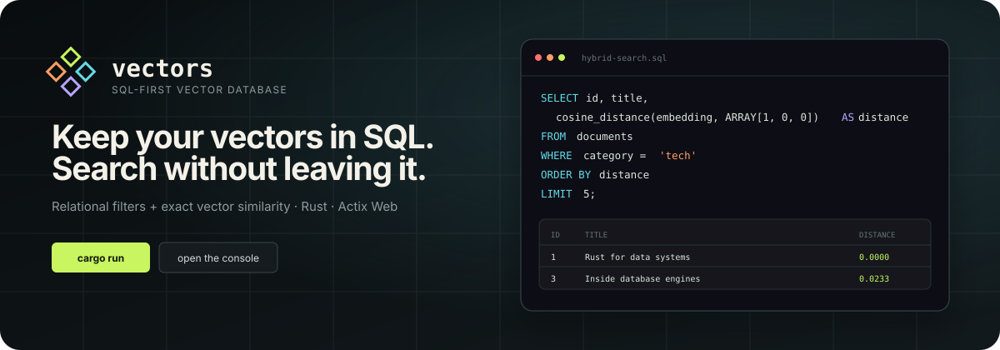
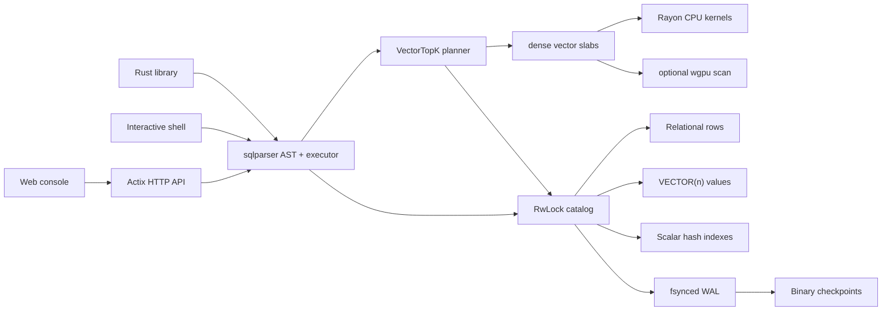

<p align="center">
  
</p>

<p align="center">
  <a href="https://github.com/kamilsj/vectors/actions/workflows/ci.yml"></a>
  <a href="https://github.com/kamilsj/vectors/stargazers"></a>
  
</p>

<p align="center">
  <strong>An embeddable vector database where relational data and embeddings share one query language: SQL.</strong>
</p>

<p align="center">
  Rust 2021 · SQL parser · exact vector search · Actix Web · durable WAL
</p>

<p align="center">
  <a href="#try-it-in-two-minutes">Quickstart</a> ·
  <a href="docs/INSTALL.md">Install</a> ·
  <a href="docs/TUTORIAL.md">Tutorial</a> ·
  <a href="docs/BENCHMARKS.md">Benchmarks</a> ·
  <a href="docs/ARCHITECTURE.md">Architecture</a> ·
  <a href="ROADMAP.md">Roadmap</a> ·
  <a href="CONTRIBUTING.md">Contributing</a>
</p>

---

`vectors` is a lightweight database engine for applications that need metadata
filters and vector similarity in the same query. Define `VECTOR(n)` columns,
insert embeddings beside normal relational values, and search both without
introducing a second query language or a separate metadata store.

```sql
SELECT id, title,
       cosine_distance(embedding, ARRAY[1, 0, 0]) AS distance
FROM documents
WHERE category = 'tech'
ORDER BY distance
LIMIT 5;
```

> **Project status:** `vectors` is pre-1.0. It is suitable for prototypes,
> local tools, tests, small embedded workloads, and controlled single-node
> deployments with workload testing. It is not yet a replacement for a
> distributed or replicated production database.

New to the project? The [guided tutorial](docs/TUTORIAL.md) covers installation,
every shell command, the web console, SQL and typed API examples, persistence,
GPU selection, production batching, and troubleshooting.

## Install and launch

The installers detect your processor, verify the release archive checksum,
install both binaries for the current user, start a durable server, and open
the web console when a desktop is available. Releases support Linux x86-64 and
ARM64, macOS Intel and Apple silicon, and Windows x86-64.

Linux or macOS:

```sh
installer="$(mktemp)"
curl --proto '=https' --tlsv1.2 -LsSf \
  https://github.com/kamilsj/vectors/releases/latest/download/install.sh \
  -o "$installer"
sh "$installer"
rm -f "$installer"
```

Windows x86-64 PowerShell:

```powershell
$installer = Join-Path $env:TEMP 'vectors-install.ps1'
irm 'https://github.com/kamilsj/vectors/releases/latest/download/install.ps1' -OutFile $installer
Unblock-File $installer
& $installer
Remove-Item $installer
```

The console opens at [http://127.0.0.1:8080](http://127.0.0.1:8080). Pass
`--no-start` to the POSIX script or `-NoStart` to PowerShell for an install-only
run. Use `--print-target` or `-PrintTarget` to inspect architecture selection
without downloading anything. Use `--dry-run` or PowerShell's `-WhatIf` to
preview the complete plan. The [installation guide](docs/INSTALL.md) covers
every option, fixed versions, upgrades, uninstalling, release verification,
default paths, and common setup problems. Release CI installs and health-checks
every supported OS/architecture combination.

Installer-managed servers retain their bind and storage configuration across
upgrades. Restarts use a private cooperative-shutdown request so the server can
finish its WAL checkpoint or legacy snapshot before binaries are replaced; a
failed start restores the prior runtime and configuration.

Upgrading from 0.2 reuses the existing `vectors.vdb` as the first durable
checkpoint and begins logging subsequent writes; no export step is required.

If port 8080 is already occupied, replace the installer invocation above with
one of these commands before removing the downloaded file:

```sh
sh "$installer" --bind 127.0.0.1:8081
```

```powershell
& $installer -BindAddress '127.0.0.1:8081'
```

## Why vectors?

- **SQL first.** Create schemas, filter metadata, aggregate rows, upsert data,
  and rank vectors with familiar SQL.
- **Schema-aware intent.** Analyze a `SELECT` before execution, expand `*`, and
  identify keys, content, attributes, embeddings, aggregates, and similarity
  scores, including `DISTINCT`, grouping, and `HAVING` semantics.
- **Self-describing results.** Every query response carries declared SQL types
  even when the result is empty or contains only `NULL` values; expression type
  errors are rejected before scanning rows.
- **Hybrid by default.** Scalar hash indexes prune relational candidates before
  exact vector distance evaluation; predicates fully covered by an index are
  not evaluated a second time row by row.
- **Dense scan storage.** Each vector column has append-only, contiguous `f32`
  slabs with cached norms and compact presence metadata, so exact scans avoid
  walking the relational `Value` representation for every candidate.
- **Rust all the way down.** Memory-safe engine code, immutable vector values,
  cached norms, and SIMD-friendly distance loops.
- **Optional GPU execution.** Release binaries can move sufficiently large
  compatible exact scans to a bounded wgpu cache on Vulkan, DirectX 12, or
  Metal; automatic mode falls back to the CPU without changing SQL semantics.
- **Low repeat-query overhead.** Cloned handles share a bounded SQL AST cache;
  schema checks still run against the current catalog on every execution.
- **Direct typed ingestion.** JSON and Rust values enter the shared atomic
  insert core without being serialized into SQL literals and parsed again.
- **Incremental scalar indexes.** Append-only batches add hash buckets for new
  rows without rescanning the existing table.
- **Indexed uniqueness.** Primary-key and `UNIQUE` checks use maintained key
  maps, making idempotent batch replay independent of existing table scans.
- **One engine, three interfaces.** Embed the library, use the interactive
  shell, or run the Actix HTTP server with its built-in web console.
- **Durability built in.** Start either binary with `--data-dir` to protect
  acknowledged writes with a checksummed, fsynced write-ahead log and compact
  binary checkpoints. The installers choose a durable data directory for you.
- **No frontend toolchain.** The console ships inside the server with no CDN,
  Node runtime, or asset build required.

## Fast path for SQL vector search

The planner recognizes the common exact-search shape:

```sql
SELECT id, title,
       cosine_distance(embedding, ARRAY[1, 0, 0]) AS distance
FROM documents
WHERE category = 'tech'
ORDER BY distance
LIMIT 20;
```

For safe projections, this becomes a specialized `VectorTopK` plan:

1. scalar hash indexes prune relational candidates;
2. fully indexed filters skip redundant row-level expression evaluation;
3. the query vector is evaluated once rather than once per row;
4. scoring reads contiguous vector slabs and their cached norms directly;
5. the CPU path uses SIMD-friendly kernels and Rayon thread-local bounded
   heaps, while eligible large scans may use the optional wgpu compute path;
6. text, vectors, and other projected values are cloned only for final winners.

Queries with additional sort keys, `DISTINCT`, or complex projections fall back
to the general SQL executor without changing their semantics. Use `EXPLAIN` to
see whether a statement selected `VectorTopK`.

GPU execution accelerates scoring; result selection and projection remain on
the CPU. It is considered only when `VectorTopK` has no residual predicate to
evaluate row by row. `auto` also checks the candidate-count × dimensions
crossover, adapter availability, device limits, and the configured cache bound.
Any of those checks may retain the Rayon path. For scans that satisfy the GPU
eligibility rules, `gpu` requires accelerator execution and returns a clear
error when the adapter or limits cannot satisfy it. Queries outside the
specialized eligibility rules continue through their normal CPU executor.
Resident columns may be split into device-sized shards, and dispatch/readback
is batched, so a scan is not limited to one result or storage buffer.

WAL writes are sequential and typed embedding batches store vectors as compact
binary `f32` values rather than SQL text. Checkpoint I/O uses 1 MiB sequential
buffers and encodes or decodes each vector in one contiguous operation. The
format remains backward compatible and entirely safe Rust—no memory mapping or
unsafe borrowed file pages.

Run the reproducible local benchmark:

```sh
cargo run --release --example benchmark_vector_search
cargo run --release --features gpu --example benchmark_vector_search -- --compute auto
```

The benchmark defaults to `cpu` for repeatable historical comparisons. Pass
`--compute cpu|auto|gpu`, or set `VECTORS_COMPUTE_DEVICE`; it validates the set
of returned primary keys against the general SQL executor before timing.

On the development machine, the median 20,000-row × 64-dimension filtered
cosine query—10,000 exact candidates and a top-20 result—took 0.471 ms after
the indexed-filter optimization, down from 0.697 ms in 0.5.0. All returned
neighbors were compared for equality. Treat this 32.4% latency reduction as an
in-project regression result, not a cross-database benchmark; hardware,
exact-versus-approximate behavior, recall, and workloads matter. The exact
method, raw process medians, environment controls, and reporting rules are in
[the benchmark guide](docs/BENCHMARKS.md).

The durable-storage harness sustained about 351,000 rows/s for ten fsynced
1,000-row × 64-dimension typed batches, then recovered its 2.73 MiB WAL in
11.56 ms. These are embedded-path regression numbers from the same development
machine; transaction size and storage hardware materially change the result.

## Try it in two minutes

### 1. Start the web console

```sh
cargo run --release --bin vectors-server -- --data-dir ./vectors-data
```

Open [http://127.0.0.1:8080](http://127.0.0.1:8080). The console includes:

- a multiline SQL editor with ready-to-run examples;
- schema-aware **Understand query** analysis before execution;
- live table, schema, index, row-count, and revision navigation;
- a guided structured vector-search builder;
- relational filters, selectable distance metrics, and ranked result tables;
- optional bearer-token authentication stored only in the browser tab.

Click **Run query** on the default quickstart, select the new `documents` table,
then open **Search vectors**.

### 2. Or use the shell

```sh
cargo run --release --bin vectors
```

```text
vectors 0.6.0 | in-memory SQL vector database
Type .tutorial to begin, .help for commands. End SQL with ';'.
vectors>
```

Enter `.tutorial` for the built-in lesson, or run
`.read examples/quickstart.sql` from a repository checkout. Pass
`--data-dir ./vectors-data` to make shell writes durable. The
[tutorial's shell reference](docs/TUTORIAL.md#every-shell-command) documents
every dot command.

### 3. Or embed the engine

```rust
use vectors::Database;

let database = Database::open_persistent("./vectors-data")?;
database.execute(
    "CREATE TABLE points (id INTEGER PRIMARY KEY, label TEXT, v VECTOR(2))"
)?;
database.execute(
    "INSERT INTO points VALUES (1, 'origin-ish', ARRAY[0.1, 0.2])"
)?;

let result = database.execute(
    "SELECT id, label, l2_distance(v, ARRAY[0, 0]) AS distance
     FROM points ORDER BY distance LIMIT 10"
)?;

database.checkpoint()?;
# let _ = result;
# Ok::<(), vectors::Error>(())
```

Applications that already have typed values can bypass SQL literal generation:

```rust
use vectors::{Database, InsertConflict, Value, Vector};

# let database = Database::new();
# database.execute("CREATE TABLE points (id INTEGER PRIMARY KEY, label TEXT, v VECTOR(2))")?;
database.insert_rows(
    "points",
    vec![vec![
        Value::Integer(2),
        Value::Text("second".into()),
        Value::Vector(Vector::new(vec![0.2, 0.8])?),
    ]],
    InsertConflict::Fail,
)?;
# Ok::<(), vectors::Error>(())
```

See [`examples/hybrid_search.rs`](examples/hybrid_search.rs) for a complete
program and [`examples/benchmark_vector_search.rs`](examples/benchmark_vector_search.rs)
for the reproducible performance harness.

For a fuller first-run path—including the web console, HTTP API, typed bulk
ingestion, persistence, GPU configuration, and troubleshooting—continue with
the [guided tutorial](docs/TUTORIAL.md).

## A deliberately small architecture


```mermaid
flowchart LR
    A["Rust library"] --> E
    B["Interactive shell"] --> E
    C["Web console"] --> D["Actix HTTP API"]
    D --> E["sqlparser AST + executor"]
    E --> K["VectorTopK planner"]
    K --> M["dense vector slabs"]
    M --> N["Rayon CPU kernels"]
    M --> O["optional wgpu scan"]
    K --> F["RwLock catalog"]
    E --> F
    F --> G["Relational rows"]
    F --> H["VECTOR(n) values"]
    F --> I["Scalar hash indexes"]
    F --> J["fsynced WAL"]
    J --> L["Binary checkpoints"]
```

The active working set lives in memory. Cloned `Database` handles share one
catalog: readers may execute concurrently while writes are serialized. Durable
writes are staged, appended to the WAL, synchronized, and only then published
to readers. A multi-statement request commits as one unit or leaves both memory
and durable state unchanged.

## SQL and vector features

| Area | Supported |
| --- | --- |
| Schema | `CREATE/DROP TABLE`, single-column `PRIMARY KEY` and `UNIQUE` |
| Indexes | `CREATE/DROP INDEX`, scalar hash indexes |
| Writes | multi-row `INSERT`, `UPDATE`, `DELETE`, atomic statement batches |
| Upserts | `ON CONFLICT DO NOTHING`, `DO UPDATE`, `excluded.column`, optional `WHERE` |
| Queries | aliases, `DISTINCT`, `WHERE`, `ORDER BY`, `LIMIT`, `OFFSET` |
| Aggregates | `COUNT`, `SUM`, `AVG`, `MIN`, `MAX`, `DISTINCT`, `GROUP BY`, `HAVING` |
| Expressions | arithmetic, comparisons, boolean logic, `NULL`, `BETWEEN`, `IN`, `LIKE`, `ILIKE` |
| Planning | `EXPLAIN`, hash-index pruning, bounded top-k execution |
| Fast search | direct distance scoring, deferred projection, parallel top-k heaps |
| Types | integers, floating point, decimals, text, booleans, fixed-width `VECTOR(n)` |

Vector literals can be written as `ARRAY[1, 2, 3]` or `VECTOR(1, 2, 3)`.

### Distance and vector functions

- `cosine_distance(a, b)`
- `l2_distance(a, b)` / `euclidean_distance(a, b)`
- `squared_l2_distance(a, b)`
- `dot_product(a, b)` / `inner_product(a, b)`
- `vector_dims(v)` / `dimensions(v)`
- `vector_norm(v)` / `norm(v)`
- `normalize(v)` / `normalize_vector(v)`

PostgreSQL-style operator shortcuts are also accepted. For nearest-neighbor
ranking, order them as follows:

- `a <=> b` — cosine distance
- `a <-> b` — Euclidean (L2) distance
- `a <#> b` — negative dot product

## HTTP API

The server binds to `127.0.0.1:8080` by default.

| Method | Endpoint | Purpose |
| --- | --- | --- |
| `GET` | `/` | Web console |
| `GET` | `/healthz` | Public health, version, and storage-mode metadata |
| `GET` | `/readyz` | Public readiness, revision, and database-task capacity |
| `GET` | `/metrics` | Public Prometheus-compatible operational metrics |
| `POST` | `/v1/sql` | Execute one or more SQL statements |
| `POST` | `/v1/sql/intent` | Validate and explain one read-only `SELECT` |
| `GET` | `/v1/tables` | Table summaries and catalog revision |
| `GET` | `/v1/tables/{table}/schema` | Typed column metadata |
| `GET` | `/v1/tables/{table}/indexes` | Scalar index metadata |
| `POST` | `/v1/tables/{table}/rows` | Typed bulk ingestion and upserts |
| `POST` | `/v1/vector/search` | Structured hybrid vector search |
| `POST` | `/v1/embeddings/search` | Compatibility alias for `/v1/vector/search` |

Run SQL:

```sh
curl http://127.0.0.1:8080/v1/sql \
  -H 'content-type: application/json' \
  -d '{"sql":"SELECT id, title FROM documents ORDER BY id"}'
```

Each query result inside `results` keeps the simple `columns` and `rows` arrays
and adds stable typed metadata for clients that must not infer a schema from
returned values:

```json
{
  "type": "query",
  "columns": ["id", "distance"],
  "schema": [
    {"name": "id", "data_type": "INTEGER"},
    {"name": "distance", "data_type": "DOUBLE"}
  ],
  "rows": [],
  "row_count": 0,
  "rows_examined": 0
}
```

Types come from schema-aware AST validation, not from the first returned row.
Invalid arithmetic, predicates, vector functions, dimensions, and sort keys
therefore fail consistently even when the source table is empty.

Understand a query without executing it:

```sh
curl http://127.0.0.1:8080/v1/sql/intent \
  -H 'content-type: application/json' \
  -d '{
    "sql":"SELECT * FROM documents WHERE category = '\''tech'\'' LIMIT 5"
  }'
```

The response expands `*` against the current schema and assigns each output a
role such as `identifier`, `content`, `attribute`, or `embedding`. Vector-ranked
queries also report the metric, vector column, dimensions, direction, and
whether the specialized `VectorTopK` path is available. Aggregate queries
report declared output types, aggregate roles, `DISTINCT`, `GROUP BY`, and
`HAVING`. The analyzer accepts exactly one `SELECT`; it never executes mutations
or invents missing schema.

Run structured hybrid search without constructing SQL in the client:

```sh
curl http://127.0.0.1:8080/v1/vector/search \
  -H 'content-type: application/json' \
  -d '{
    "table": "documents",
    "vector_column": "embedding",
    "query": [1.0, 0.0, 0.0],
    "metric": "cosine",
    "select": ["id", "title"],
    "filters": [{"column": "category", "operator": "eq", "value": "tech"}],
    "limit": 5
  }'
```

JSON request bodies default to 32 MiB, typed bulk ingestion to 10,000 rows per
request, and the combined SQL response to 10,000 query rows. All three limits
are configurable within hard ceilings; structured vector search keeps its
separate 1,000-row maximum. SQL execution pushes that budget into the planner,
so oversized final output is rejected without constructing an unbounded HTTP
response. This is an output bound rather than a general query-memory limit:
filtering, aggregation, `DISTINCT`, ordering, and a large `OFFSET` may still
scan or retain additional working state required by SQL semantics.

Typed ingestion performs JSON validation on a blocking worker and shares SQL
`INSERT` constraint, conflict, revision, and index-maintenance semantics without
reparsing generated SQL. Database handlers also share a process-wide capacity
limit. When it is exhausted, new database requests receive HTTP 503 with error
code `overloaded` and `Retry-After: 1`.

## Server configuration

Select a local port directly from the command line:

```sh
vectors-server --data-dir ./vectors-data --port 8081
vectors-server --data-dir ./vectors-data --bind 0.0.0.0:9000
vectors-server --data-dir ./vectors-data --compute auto
```

`--port` listens on localhost. Use `--bind` when the host address also needs to
change. Bind options override `VECTORS_BIND`, and `--data-dir` overrides
`VECTORS_DATA_DIR`; without a bind setting, the server uses `127.0.0.1:8080`.

```sh
VECTORS_BIND=127.0.0.1:9000 \
VECTORS_DATA_DIR=./vectors-data \
VECTORS_API_TOKEN=replace-with-a-long-random-token \
VECTORS_MAX_CONCURRENT_DATABASE_TASKS=8 \
VECTORS_COMPUTE_DEVICE=auto \
cargo run --release --features gpu --bin vectors-server
```

| Variable | Meaning |
| --- | --- |
| `VECTORS_BIND` | Listen address when `--port` or `--bind` is not supplied; defaults to `127.0.0.1:8080` |
| `VECTORS_DATA_DIR` | Durable directory containing `vectors.wal`, `vectors.vdb`, and the process lock |
| `VECTORS_SNAPSHOT` | Legacy snapshot-only mode; mutually exclusive with `VECTORS_DATA_DIR` |
| `VECTORS_AUTOSAVE_INTERVAL_SECS` | Legacy snapshot checkpoint interval; requires `VECTORS_SNAPSHOT` |
| `VECTORS_API_TOKEN` | Requires `Authorization: Bearer …` on every `/v1` endpoint |
| `VECTORS_COMPUTE_DEVICE` | Exact-vector scan policy: `auto`, `cpu`, or `gpu`; defaults to `auto`; overridden by `--compute` |
| `VECTORS_GPU_MIN_ELEMENTS` | Candidate count × dimensions required before `auto` tries the GPU; defaults to `8388608` |
| `VECTORS_GPU_CACHE_BYTES` | Upper bound for resident cached dense GPU columns; defaults to `536870912` (512 MiB) |
| `VECTORS_HTTP_WORKERS` | Actix worker count; defaults to available CPU parallelism |
| `VECTORS_HTTP_MAX_BLOCKING_THREADS_PER_WORKER` | Blocking threads per Actix worker; defaults to `1` |
| `VECTORS_HTTP_MAX_CONNECTIONS_PER_WORKER` | Simultaneous connections per worker; defaults to `4096` |
| `VECTORS_MAX_CONCURRENT_DATABASE_TASKS` | Process-wide database task capacity; defaults to available CPU parallelism |
| `VECTORS_HTTP_MAX_JSON_BYTES` | Maximum buffered JSON request body; defaults to `33554432` (32 MiB), maximum `67108864` (64 MiB) |
| `VECTORS_HTTP_MAX_BULK_ROWS` | Maximum rows in one typed bulk-ingestion request; defaults to `10000`, maximum `1000000` |
| `VECTORS_HTTP_MAX_RESPONSE_ROWS` | Maximum combined query rows returned by one SQL request; defaults to `10000`, maximum `1000000` |
| `VECTORS_HTTP_KEEP_ALIVE_SECS` | HTTP keep-alive timeout; defaults to `30` |
| `VECTORS_HTTP_CLIENT_TIMEOUT_SECS` | Timeout for receiving initial request headers; defaults to `5` |
| `VECTORS_HTTP_SHUTDOWN_TIMEOUT_SECS` | Grace period for workers during shutdown; defaults to `30` |
| `VECTORS_SHUTDOWN_FILE` | Absolute private request-file path for cooperative graceful shutdown; managed automatically by the installers |

All numeric capacity and timeout variables must be positive. Start with the
defaults, load-test the actual dimensions, filter selectivity, and concurrency,
then adjust database-task capacity before increasing blocking threads. The
catalog is shared, so extra workers improve admission and concurrent reads but
do not remove write serialization. Request-limit values above their documented
hard maxima are rejected during server startup.

The upper HTTP bounds are safety ceilings, not recommended batch sizes. Every
durable mutation must fit the WAL format's 64 MiB encoded-record cap, and a typed
WAL batch is additionally capped at 1,000,000 rows. JSON, SQL, row, and WAL
metadata consume part of the byte budget, so a request accepted by the HTTP
decoder can still be too large for one durable record. Split larger imports into
independently retryable batches with headroom below the WAL-compatible cap.

The default Cargo feature set keeps the embeddable library free of a GPU
runtime. In such builds, `auto` uses the CPU and `gpu` reports that the feature
is unavailable when an eligible GPU scan is executed. Official release binaries
are built with `--features gpu`; they still start normally on hosts without a
supported adapter because `auto` falls back. Force the portable path with
`--compute cpu` when predictable CPU placement matters more than accelerator
selection.

Use `/healthz` for process liveness, `/readyz` for readiness and current
capacity, and `/metrics` for scraping. The console and those three operational
endpoints remain public when authentication is enabled, but all `/v1` database
API calls require the token. There is no built-in TLS or per-user authorization;
keep the default localhost bind or place the server behind a TLS-enabled reverse
proxy. The capacity guard bounds concurrent database work; it is not a per-query
CPU, memory, or execution-time limit.

## Persistence model

`Database::open_persistent` opens or creates a data directory and obtains an
exclusive process lock. The common append-only, single-statement durable
`INSERT` path validates an append delta under the write lock, synchronizes its
WAL record, and applies that delta only after the append succeeds; it does not
clone the full catalog. Typed embedding batches use the same append-delta
boundary when their conflict policy permits it. Multi-statement write requests
and mutations that replace existing rows remain staged against an isolated
catalog before one WAL commit. Failed validation or I/O leaves the live catalog
unchanged in either path.

On startup, `vectors` loads `vectors.vdb` into memory and replays newer WAL
records. A torn final record is safely discarded; checksum errors, invalid
sequences, and operations that cannot be replayed stop startup rather than
silently exposing partial data. The WAL is compacted automatically after 64 MiB
and on graceful server shutdown. `Database::checkpoint` and the shell's
`.checkpoint` command trigger compaction explicitly. A checkpoint holds a shared
catalog read guard while it writes the snapshot and resets the WAL: concurrent
reads and searches continue, while writers wait for that coherent boundary.

Vectors remain dense contiguous `f32` values on disk. In memory, every vector
column also has append-only batch slabs with one cached norm and presence bit
per row; row-level vector values are shared views into those slabs. Appends add
a slab without repacking older batches, while updates and deletes rebuild the
table's vector-column generations. Checkpoints use bounded decoding and 1 MiB
buffered I/O, validate dimensions and finite values before allocation, rebuild
indexes and dense scan storage, and retain compatibility with snapshot versions
1 and 2.

Snapshot loading reconstructs dense vector columns incrementally instead of
first retaining a second table-sized vector copy. Decode batches are bounded by
an 8 MiB vector payload target and at most 65,536 rows; the in-memory dense
layout independently splits vector slabs around an 8 MiB `f32` payload target.

`Database::save` and `Database::open` remain available for portable standalone
snapshots. Snapshot saves copy a coherent catalog and perform disk I/O without
holding the catalog lock; they are backups or explicit exports, not a substitute
for WAL durability.

`Database::revision` remains an in-process change token. Durable record sequence
numbers are separate and are persisted in snapshot format version 3.

## Current limitations

- exact search only; no approximate-nearest-neighbor index yet;
- no joins, subqueries, window functions, or aggregate `FILTER` clauses;
- no explicit transaction spanning multiple HTTP requests;
- checkpoint creation pauses writers while snapshot and WAL reset complete;
  concurrent reads continue;
- no replication;
- no roles, per-user authorization, or built-in TLS.

Keeping these boundaries visible is intentional: `vectors` should be easy to
understand before it becomes broad. Planned work and its acceptance criteria
are tracked in [ROADMAP.md](ROADMAP.md).

## Development

```sh
cargo fmt --all -- --check
cargo clippy --all-targets --all-features -- -D warnings
cargo test --all-targets --all-features
cargo doc --all-features --no-deps
```

CI runs formatting, linting, documentation, tests, and native release builds on
Linux, macOS, and Windows. See [CONTRIBUTING.md](CONTRIBUTING.md) before
proposing a large SQL or storage change. Design invariants live in
[docs/ARCHITECTURE.md](docs/ARCHITECTURE.md), performance results in
[docs/BENCHMARKS.md](docs/BENCHMARKS.md), and security reporting guidance in
[SECURITY.md](SECURITY.md). User-facing examples and the complete command
reference live in [docs/TUTORIAL.md](docs/TUTORIAL.md).
