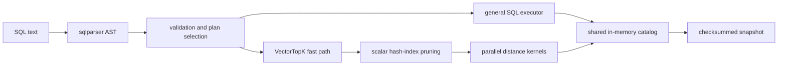

# Architecture

`vectors` is an in-process SQL database with first-class fixed-width vectors.
The architecture is intentionally compact: one parser, one catalog, one
executor, and one versioned snapshot format. This document records the
boundaries that should remain stable as the engine grows.

## Request path

The Actix server and interactive shell both call the same public `Database`
API. The HTTP vector-search endpoint validates structured JSON and translates
it into SQL, so it does not maintain a second query implementation. The typed
ingestion endpoint converts JSON directly to `Value` rows and calls the same
atomic insert core used by SQL `INSERT`; it does not serialize values back into
SQL. Parsed ASTs for repeated SQL are kept in a shared least-recently-used cache
capped at 64 entries, 64 KiB per request string, and 1 MiB of SQL text in total.
ASTs do not contain catalog data and are validated against the current schema
every time they execute.

## Catalog and concurrency

A `Database` owns an `Arc<RwLock<Catalog>>`. Cloning the handle shares that
catalog rather than copying data.

- Read statements acquire a read lock and may run concurrently.
- Write statements acquire the write lock and increment the catalog revision.
- A request containing multiple statements and at least one write executes
  against a private catalog copy. The copy replaces the live catalog only when
  every statement succeeds.
- Snapshot saves copy a coherent catalog while holding a read lock, then release
  the lock before disk I/O. A separate mutex serializes saves from cloned
  handles.
- Cloned handles share the bounded parse cache. Cache failure or lock poisoning
  falls back to parsing and cannot make SQL execution unavailable.

The catalog currently stores rows as `Vec<Vec<Value>>`. That layout favors a
small implementation and flexible SQL values, but is not the final layout for
large analytical workloads. Any future columnar or slab layout must preserve
the `Value`-level API or introduce an explicit compatibility boundary.

## SQL planning

`sqlparser` produces syntax trees using its generic dialect. The engine then
performs schema lookup, type validation, expression evaluation, and execution.
It has two relevant query paths:

1. The general executor supports the complete SQL subset documented in the
   README.
2. `VectorTopK` recognizes a single vector-distance sort with a `LIMIT` and a
   projection that is safe to defer. It evaluates the query vector once,
   applies eligible scalar hash indexes, and keeps only the best candidates in
   bounded heaps. Large candidate sets use Rayon thread-local heaps followed by
   a deterministic merge.

Queries with additional sort keys, `DISTINCT`, or unsupported expressions use
the general executor. The fast path is an optimization, not a separate SQL
dialect. Tests compare both paths to prevent semantic drift.

## Vector representation

`Vector` owns contiguous `f32` elements and caches its L2 norm. Construction
rejects empty vectors, excessive dimensions, and non-finite values. Binary
operations require equal dimensions.

Distance kernels use ordinary safe Rust loops arranged for compiler
vectorization. The crate forbids `unsafe` code. This is a deliberate baseline:
architecture-specific kernels are welcome only with portable fallbacks,
correctness tests, and measured improvements on more than one target.

## Scalar indexes

Scalar hash indexes map normalized scalar keys to row positions. Equality
predicates can use them to reduce the candidate set before expression or vector
evaluation. Append-only `INSERT` and `DO NOTHING` batches extend buckets only
for accepted rows. Updates, deletes, and conflict updates conservatively rebuild
affected table indexes because existing row values may change. Indexes are also
rebuilt and validated while loading snapshots.

Primary-key and `UNIQUE` columns have separate internal key-to-row maps. Live
insert validation and conflict checks use those maps rather than scanning the
table. Snapshot loading deliberately validates persisted rows before rebuilding
the maps, so corrupt data cannot be hidden by cached index state. Replacement
updates are validated against an empty prospective table and rebuild maps only
after the complete mutation succeeds.

Vector columns do not yet have an approximate-nearest-neighbor index. Exact
search is useful for small and filtered working sets and provides the reference
result against which a future ANN implementation must be tested.

## Persistence

Snapshots contain a signature, format version, deterministic table data, index
definitions, and a checksum. Version 2 is the current writer format; the reader
accepts versions 1 and 2.

Writes go to a sibling temporary file and are installed with filesystem
replacement only after the stream is complete. Loading applies explicit bounds
before allocation, validates schemas and vector dimensions, checks uniqueness,
rebuilds indexes, verifies the checksum, and rejects trailing bytes.

Snapshots are checkpoints, not a write-ahead log. Durability covers a completed
save, not writes made after the last checkpoint.

## Invariants for changes

- The optimized and general query paths must return equivalent rows.
- Failed multi-statement writes must leave the visible catalog unchanged.
- SQL and typed bulk insertion must share coercion, constraint, conflict,
  revision, and index-maintenance behavior.
- Stored vectors contain only finite `f32` values of the declared dimension.
- Snapshot readers bound allocations before reading attacker-controlled sizes.
- Existing snapshot versions remain readable unless a migration and a format
  policy are documented first.
- Public API handlers execute blocking database work outside Actix worker
  futures.
- Benchmark claims include the query, data shape, build profile, environment,
  and comparison scope.

## Extension points

The next substantial boundaries are an ANN index behind the planner, a
write-ahead log beneath catalog mutations, prepared statements above AST
validation, and a denser vector storage layout below `Value`. See
[the roadmap](../ROADMAP.md) for ordering and acceptance criteria.
