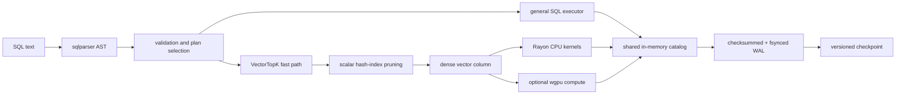

# Architecture

`vectors` is an in-process SQL database with first-class fixed-width vectors.
The architecture is intentionally compact: one parser, one catalog, one
executor, and a directory-backed durability layer. This document records the
boundaries that should remain stable as the engine grows.

## Request path

```mermaid
flowchart LR
    SQL["SQL text"] --> Parser["sqlparser AST"]
    Parser --> Planner["validation and plan selection"]
    Planner --> General["general SQL executor"]
    Planner --> TopK["VectorTopK fast path"]
    General --> Catalog["shared in-memory catalog"]
    TopK --> Index["scalar hash-index pruning"]
    Index --> Dense["dense vector column"]
    Dense --> CPU["Rayon CPU kernels"]
    Dense --> GPU["optional wgpu compute"]
    CPU --> Catalog
    GPU --> Catalog
    Catalog --> WAL["checksummed + fsynced WAL"]
    WAL --> Snapshot["versioned checkpoint"]
```

The Actix server and interactive shell both call the same public `Database`
API. The HTTP vector-search endpoint validates structured JSON and translates
it into SQL, so it does not maintain a second query implementation. The typed
ingestion endpoint converts JSON directly to `Value` rows and calls the same
atomic insert core used by SQL `INSERT`; it does not serialize values back into
SQL. Parsed ASTs for repeated SQL are kept in a shared least-recently-used cache
capped at 64 entries, 64 KiB per request string, and 1 MiB of SQL text in total.
ASTs do not contain catalog data and are validated against the current schema
every time they execute.

`Database::query_intent` uses the same parser, schema lookup, projection
expansion, expression validation, and `VectorTopK` recognizer without scanning
rows or executing the statement. It accepts exactly one `SELECT`. Direct
columns receive deterministic roles (identifier, content, attribute, or
embedding); vector-distance outputs become similarity scores and other
expressions are statically typed from the AST. Aggregate outputs, `DISTINCT`,
`GROUP BY`, and `HAVING` are described explicitly. This is catalog
interpretation, not a natural-language model: ambiguous or absent tables and
columns are rejected instead of guessed.

The executor carries declared output types beside column labels through the
general, aggregate, and `VectorTopK` paths. The HTTP API serializes that metadata
as a `schema` array, so clients can prepare result handling before seeing a row
and never need to infer types from JSON values or `NULL`. The same inference pass
validates arithmetic, predicates, scalar and vector functions, vector
dimensions, and sort keys before any rows are scanned.

HTTP JSON bodies, typed-ingestion row counts, and SQL response rows have
explicit configurable bounds. The SQL endpoint passes one shared response-row
budget into execution. Unordered scans can stop at the overflow sentinel and
ordered top-k plans keep bounded heaps, so an oversized response is rejected
without constructing an unbounded final result set. This is not a general
query-memory limit: predicates, aggregates, `DISTINCT`, ordering with a large
`OFFSET`, and grouping may retain additional working state required by SQL
semantics. Structured vector search retains its separate 1,000-row limit.

The standalone HTTP server admits database work through one process-wide
capacity guard before scheduling it on Actix blocking workers. Capacity is held
for the complete database operation and released by an RAII permit on success
or failure. Saturated requests fail immediately with HTTP 503 and a retry hint,
rather than accumulating an unbounded work queue. Worker, connection, blocking
thread, capacity, keep-alive, client-header-timeout, and graceful-shutdown
settings are explicit. `/healthz`, `/readyz`, and `/metrics` remain outside the
database admission path so an overloaded process is still observable.

## Catalog and concurrency

A `Database` owns an `Arc<RwLock<Catalog>>`. Cloning the handle shares that
catalog rather than copying data.

- Read statements acquire a read lock and may run concurrently.
- Write statements acquire the write lock and increment the catalog revision.
- A common single-statement persistent `INSERT` is validated into an append
  delta while the writer lock is held. Its WAL record is synchronized before
  applying the delta, avoiding a full catalog clone. Typed ingestion uses the
  same boundary for append-compatible conflict policies.
- Multi-statement write requests and mutations that replace existing rows use a
  private staged catalog. Persistent databases synchronize one WAL record before
  publishing either mutation form. Validation and storage failures publish
  neither state.
- Snapshot saves copy a coherent catalog while holding a read lock, then release
  the lock before disk I/O. A separate mutex serializes saves from cloned
  handles.
- Durable checkpoint compaction holds a shared catalog read guard through
  snapshot synchronization and WAL reset. Other readers continue concurrently;
  writers wait until both files represent one coherent durable boundary.
- Cloned handles share the bounded parse cache. Cache failure or lock poisoning
  falls back to parsing and cannot make SQL execution unavailable.

Tables retain `Vec<Vec<Value>>` as the relational and public-value boundary.
Each `VECTOR(n)` column additionally owns a dense scan representation. That
separation keeps generic SQL simple while the hot vector loop avoids per-row
enum matching, pointer chasing, and repeated norm calculation.

An accepted append batch creates immutable vector slabs: contiguous `f32`
elements, cached `f64` norms, and compact presence bits for nullable rows. A
large batch is split around an 8 MiB vector-payload target. Stored row values
become shared views into a slab rather than duplicate allocations, and existing
slabs are not repacked during append-only ingestion.

Dense lookup metadata stores one starting chunk index per 4,096-row block rather
than one entry per row. Candidate lookup selects that sparse block and performs
a bounded partition search across the chunks that can overlap it. This keeps
metadata sublinear in table size while supporting streams of small append
batches. Updates, deletes, and conflict replacements conservatively rebuild the
affected table's dense columns, just as they rebuild scalar indexes.

Snapshot loading reconstructs dense columns incrementally as rows are decoded.
Each reconstruction batch is capped at 65,536 rows and targets at most 8 MiB of
vector payload, avoiding a second table-sized collection of standalone vectors
before dense storage is built.

## SQL planning

`sqlparser` produces syntax trees using its generic dialect. The engine then
performs schema lookup, type validation, expression evaluation, and execution.
It has two relevant query paths:

1. The general executor supports the complete SQL subset documented in the
   README.
2. `VectorTopK` recognizes a single vector-distance sort with a `LIMIT` and a
   projection that is safe to defer. It evaluates the query vector once,
   applies eligible scalar hash indexes, and reads candidate vectors and norms
   from the dense column. Unfiltered CPU scans walk slabs directly; fragmented
   columns can be split across Rayon workers without a per-row chunk lookup.
   The implementation keeps only the best candidates in bounded heaps and
   merges worker-local heaps deterministically. Euclidean top-k ranks squared
   distances and computes square roots only for returned score projections.

With the optional `gpu` Cargo feature, a compute policy may send eligible large
scans through wgpu. `auto` requires at least `gpu_min_elements` candidate vector
elements, initializes a high-performance adapter lazily, and returns to the CPU
path if no adapter is available or a device/cache limit is exceeded. `gpu`
reports those conditions as errors. GPU scoring is currently eligible only
when no residual predicate requires row-level expression evaluation; a filter
fully covered by a scalar index is eligible because its candidate list is
already exact.

Dense GPU columns are cached by storage generation in an LRU bounded by
`gpu_cache_bytes`. Upload walks the append chunks once per generation and splits
columns into device-sized shards when one storage binding cannot address the
whole column; any mutation gets a new generation and therefore cannot reuse
stale device data. Candidate indexes and the query vector are uploaded per scan.
Indexed candidate uploads and score readback use bounded windows (readback is
capped at 32 MiB per dispatch). Scores stream directly into the CPU's bounded
top-k heap instead of forming a request-sized score vector. “Exact” here means
exhaustive rather than ANN; CPU and GPU floating-point accumulation need not be
bit-identical.

Index candidate planning carries an `exact` flag in addition to row positions.
A direct indexed equality predicate is exact. `AND` and `OR` combinations are
exact only when every required branch is index-covered; otherwise the index
result is candidate pruning and the full predicate is evaluated.
This distinction lets all query executors skip redundant row-level predicate
evaluation without changing the semantics of partially indexed expressions.

Queries with additional sort keys, `DISTINCT`, or unsupported expressions use
the general executor. The fast path is an optimization, not a separate SQL
dialect. Tests compare both paths to prevent semantic drift.

## Vector representation

`Vector` exposes contiguous `f32` elements and caches its L2 norm. Standalone
vectors own their buffer; table vectors may be immutable views into a shared
dense chunk. Construction rejects empty vectors, excessive dimensions, and
non-finite values. Binary operations require equal dimensions.

Distance kernels use ordinary safe Rust loops arranged for compiler
vectorization. The optional GPU path uses a WGSL compute shader through wgpu;
the crate itself still forbids `unsafe` code. Accelerator selection always has
a portable CPU fallback in `auto` mode. Architecture-specific kernels are
welcome only with portable fallbacks, correctness tests, and measured
improvements on more than one target.

## Scalar indexes

Scalar hash indexes map normalized scalar keys to row positions. Equality
predicates can use them to reduce the candidate set before expression or vector
evaluation. Append-only `INSERT` and `DO NOTHING` batches extend buckets only
for accepted rows. Updates, deletes, and conflict updates conservatively rebuild
affected table indexes because existing row values may change. Indexes are also
rebuilt and validated while loading snapshots.

Primary-key and `UNIQUE` columns have separate internal key-to-row maps. Live
insert validation and conflict checks use those maps rather than scanning the
table. Snapshot loading deliberately validates persisted rows before rebuilding
the maps, so corrupt data cannot be hidden by cached index state. Replacement
updates are validated against an empty prospective table and rebuild maps only
after the complete mutation succeeds.

Vector columns do not yet have an approximate-nearest-neighbor index. Exact
search is useful for small and filtered working sets and provides the reference
result against which a future ANN implementation must be tested.

## Persistence

`Database::open_persistent` owns an exclusive lock on one data directory. The
active catalog stays memory-resident so query execution does not perform random
disk reads. Writes become sequential WAL records containing either the original
atomic SQL request or a binary typed-ingestion batch. Record length, sequence,
and checksum validation bound recovery and detect corruption. `sync_data` runs
before a validated direct append delta or staged catalog is published, so a
successful return means the WAL has been handed to the operating system for
durable synchronization.

Recovery loads `vectors.vdb`, skips WAL records already represented by its
durable sequence, and replays newer records through the same public mutation
paths. An incomplete final record is treated as a torn append and truncated.
Checksum mismatches, sequence gaps, and replay failures are fatal.

Snapshots contain a signature, format version, deterministic table data, index
definitions, durable WAL sequence, and a checksum. Version 3 is the current
writer format; the reader accepts versions 1 through 3.

Writes go to a sibling temporary file and are installed with filesystem
replacement only after the stream is complete. Loading applies explicit bounds
before allocation, validates schemas and vector dimensions, checks uniqueness,
rebuilds dense vector columns incrementally in bounded batches, rebuilds scalar
indexes, verifies the checksum, and rejects trailing bytes.

The WAL compacts after 64 MiB and during graceful server shutdown. Checkpointing
holds a shared catalog read guard while the snapshot is synchronized and the WAL
is reset. Concurrent reads and vector searches continue, while writes wait so
the files retain one coherent durable sequence. That sequence makes both crash
orderings safe: recovery can use an older checkpoint with the full WAL, or a
newer checkpoint with a not-yet-reset WAL without applying a transaction twice.

## Invariants for changes

- The optimized and general query paths must return equivalent rows.
- Failed multi-statement writes must leave the visible catalog unchanged.
- A failed WAL append must leave the visible catalog unchanged.
- Recovery may discard only an incomplete final record; internal corruption is
  never silently skipped.
- SQL and typed bulk insertion must share coercion, constraint, conflict,
  revision, and index-maintenance behavior.
- Stored vectors contain only finite `f32` values of the declared dimension.
- Dense vector row counts, chunks, norms, and presence metadata remain aligned
  with the relational rows after every mutation and recovery.
- A GPU cache entry is reusable only for the same dense storage generation;
  `auto` failures fall back without changing query semantics.
- Snapshot readers bound allocations before reading attacker-controlled sizes.
- Snapshot versions 1 and 2 remain readable; new formats require explicit
  compatibility and corruption tests.
- Public API handlers execute blocking database work outside Actix worker
  futures.
- HTTP database work is bounded by a process-wide admission limit and overload
  remains observable through readiness and metrics endpoints.
- HTTP JSON, bulk-row, and response-row limits are validated against hard
  ceilings; SQL response limits are enforced during result materialization.
- Benchmark claims include the query, data shape, build profile, environment,
  and comparison scope.

## Extension points

The next substantial boundaries are an ANN index behind the planner,
non-blocking checkpoint rotation, prepared statements above AST validation,
and bounded external-memory ingestion that does not require cloning an entire
prospective catalog. See [the roadmap](../ROADMAP.md) for ordering and
acceptance criteria.
