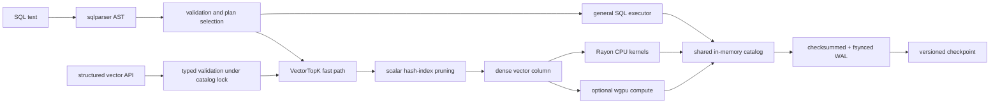

# Architecture

`vectors` is an in-process SQL database with first-class fixed-width vectors.
The architecture is intentionally compact: one parser, one catalog, one
executor, and a directory-backed durability layer. This document records the
boundaries that should remain stable as the engine grows.

## Request path

```mermaid
flowchart LR
    SQL["SQL text"] --> Parser["sqlparser AST"]
    Parser --> Planner["validation and plan selection"]
    Planner --> General["general SQL executor"]
    Planner --> TopK["VectorTopK fast path"]
    JSON["structured vector API"] --> Typed["typed validation under catalog lock"]
    Typed --> TopK
    General --> Catalog["shared in-memory catalog"]
    TopK --> Index["scalar hash-index pruning"]
    Index --> Dense["dense vector column"]
    Dense --> CPU["Rayon CPU kernels"]
    Dense --> GPU["optional wgpu compute"]
    CPU --> Catalog
    GPU --> Catalog
    Catalog --> WAL["checksummed + fsynced WAL"]
    WAL --> Snapshot["versioned checkpoint"]
```

The Actix server and interactive shell both call the same public `Database`
API. The HTTP vector-search endpoint passes typed vectors and scalar filters to
`Database::search_vectors`. It validates the schema and builds a top-k plan under
one catalog read lock, reusing SQL predicate evaluation, index pruning, ranking,
and compute execution. Query vectors never become SQL strings or AST literals;
only scalar predicates need small AST nodes. Conjunctions are balanced to bound
stack depth for large filter lists. Explicit selected columns must be distinct.
The typed ingestion endpoint converts owned JSON directly to `Value` rows and calls the same
atomic insert core used by SQL `INSERT`; it does not serialize values back into
SQL. Parsed ASTs for repeated SQL are kept in a shared least-recently-used cache
capped at 64 entries, 64 KiB per request string, and 1 MiB of SQL text in total.
ASTs do not contain catalog data and are validated against the current schema
every time they execute. Structured searches do not populate or evict that cache.
Ingestion uses one schema lookup map and reusable row buffers, moves strings,
and normalizes owned vector buffers in place. `insert_rows_if_schema` compares
the inspected column definitions under the insert's write lock, before conflict
preparation, WAL append, or mutation; a changed schema rejects the entire batch.

`Database::query_intent` uses the same parser, schema lookup, projection
expansion, expression validation, and `VectorTopK` recognizer without scanning
rows or executing the statement. It accepts exactly one `SELECT`. Direct
columns receive deterministic roles (identifier, content, attribute, or
embedding); vector-distance outputs become similarity scores and other
expressions are statically typed from the AST. Aggregate outputs, `DISTINCT`,
`GROUP BY`, and `HAVING` are described explicitly. This is catalog
interpretation, not a natural-language model: ambiguous or absent tables and
columns are rejected instead of guessed.

The executor carries declared output types beside column labels through the
general, aggregate, and `VectorTopK` paths. The HTTP API serializes that metadata
as a `schema` array, so clients can prepare result handling before seeing a row
and never need to infer types from JSON values or `NULL`. The same inference pass
validates arithmetic, predicates, scalar and vector functions, vector
dimensions, and sort keys before any rows are scanned.

HTTP JSON bodies, typed-ingestion row counts, and SQL response rows have
explicit configurable bounds. The SQL endpoint passes one shared response-row
budget into execution. Unordered scans can stop at the overflow sentinel and
ordered top-k plans keep bounded heaps, so an oversized response is rejected
without constructing an unbounded final result set. This is not a general
query-memory limit: predicates, aggregates, `DISTINCT`, ordering with a large
`OFFSET`, and grouping may retain additional working state required by SQL
semantics. Structured vector search rejects requested limits above the smaller
of the configured response-row budget and its separate 1,000-row cap.

The standalone HTTP server admits database work through one process-wide
capacity guard before scheduling it on Actix blocking workers. Capacity is held
for queued and running work by an RAII permit owned by the blocking closure,
and released on completion or panic. Cancelling the HTTP handler does not
release capacity while its database work continues, and the in-flight metric
still counts that work. All database routes use the same dispatch helper;
SQL and structured search also encode their final JSON bytes in that task. The
serializer reads typed results directly instead of building a second JSON-value
tree, preserving existing number conversion and response metadata. Thus encoding
keeps its admission permit and does not block Actix's async worker. Saturated
requests fail immediately with HTTP 503 and a retry
hint, rather than accumulating an unbounded work queue. Worker, connection, blocking
thread, capacity, keep-alive, client-header-timeout, and graceful-shutdown
settings are explicit. `/healthz`, `/readyz`, and `/metrics` remain outside the
database admission path so an overloaded process is still observable.

The HTTP SQL/intent routes also accept optional JSON `parameters`, mapped to
typed engine values. Binding runs on the admitted database worker. The SQL
tokenizer identifies `$N` placeholders and their Unicode-aware source offsets;
the binder copies all other source bytes unchanged and inserts parenthesized,
escaped literals. It never performs global string substitution. Invalid,
missing, unused, or oversized parameters fail before execution. Bound SQL uses
the same executor and WAL paths as ordinary SQL, including multi-statement
atomicity and aggregate response-row limits. This currently caches/parses the
bound SQL, not a parameter-independent prepared plan. The public Rust API
offers the same binder and `execute_with_parameters`.

## Catalog and concurrency

### Document chunks and graph retrieval

Focused neighborhoods borrow maintained unique-ID maps for chunk and document
lookup under the catalog read lock. They avoid allocating maps of every chunk
and document per request; SQL updates/deletes and snapshot/WAL reopen maintain
or rebuild these indexes. Collection profile validation still scans chunk
profiles, and high-degree traversal can still inspect many incident edges.
This optimization does not make total neighborhood cost independent of corpus
size or replace the existing collection/traversal limits.

`chunking::chunk_text` splits Unicode text with source byte offsets and bounded
overlap. The HTTP graph workflow adds versioned title/heading context, pins the
provider/model/dimensions, and generates every embedding before changing data.
Normalized chunks, source documents, configuration, and directed edges are
stored in four ordinary tables per collection, with scalar indexes for document
and edge endpoint lookup.

Collections may append up to 32 typed scalar columns to their documents table.
Declared metadata keys are removed from the free JSON object and stored in
these indexed columns; all graph readers merge the canonical fields back into
metadata. Required/type/unique checks run before embedding and at commit.
Metadata-only edits update the document row, indexes, WAL, and integrity
fingerprint without changing chunk storage generations, vectors, or edges.
They therefore retain the lexical cache. Legacy schemas and snapshots remain
compatible.

INNER/LEFT equijoin chains (up to 16 tables) bind each ON against its visible
table prefix and feed borrowed row values into the shared expression evaluator
and bounded candidate sink. A scratch row holds references, not cloned vectors
or materialized intermediate results. The two-table path retains its direct
row-pair loop. Every stage requires equality to the newly joined table.
The right-side maintained HASH or PRIMARY KEY/UNIQUE index is reused where
types match; otherwise a temporary hash lookup is built. Mixed INTEGER/DOUBLE keys use the same
numeric coercion as expression comparison. NULL keys never match; LEFT joins
produce a null-extended right row only when no pair satisfies ON. WHERE then
filters the joined row. Ordered joins still scan their matching candidates;
the existing single-table CPU/GPU vector fast paths are unchanged.

Named cross-table links are definitions in `_vectors_relationships`, with a
256-definition API bound, schema validation, and database-wide revision checks.
Definition insertion and missing endpoint HASH indexes share one atomic SQL
batch and the existing WAL/snapshot machinery. Listing checks endpoint types
and marks broken links invalid. Deletion removes only the definition. These
links do not enforce foreign keys or participate automatically in GraphRAG
traversal. The SQL join path currently excludes aggregate joins
and EXPLAIN; unsupported forms fail explicitly.

Hybrid RAG accepts up to 32 typed document predicates, validated before provider
work and again under the candidate snapshot lock. Scalar indexes narrow matching
documents; their chunk eligibility restricts exact vector top-k, BM25 ranks, and
every traversal hop before any neighbor/candidate budget is consumed. Excluded
chunks cannot be bridges or path evidence. The unfiltered/all-eligible vector
case retains the contiguous scan path. Keyword postings and BM25 corpus
statistics remain collection-wide; query-local eligibility never enters the
chunk-generation cache. Final reranking/MMR uses the same owned snapshot.
If no document matches, retrieval returns before building citation maps or
running the vector/keyword rankers. Profile and query validation still run;
this does not bypass embedding generation at the HTTP boundary.

The graph engine stages a catalog copy under the write lock. Document replacement
removes old chunks and all incident edges, adds new rows, and uses the existing
exact vector top-k executor for cross-document semantic neighbors. Adjacent and
mirrored semantic edges are bounded. In durable mode it appends one equivalent
SQL transaction to the existing WAL before publishing; recovery uses ordinary
SQL replay. This adds no storage-format version. Live graph operations use typed
values; only the durable WAL needs vector literals.

The `/search` route finds exact vector seeds and traverses indexed outgoing edges
with hop, neighbor, node, and returned-edge budgets. It preserves seeds, prevents
cycles from duplicating chunks, includes relationships among selected hits, and
checks citation slices against source text. Profile/schema mismatches are
rejected. Semantic links mean cosine proximity; application-defined relationship
labels may be inserted using SQL. No entity extraction or answer-generation
model runs inside the graph engine.

The separate RAG pipeline combines BM25 posting lists and exact vector ranks
with weighted reciprocal rank fusion, then reserves candidate capacity for graph
context when the seed budget permits. `/retrieve` uses a query-aware beam over
indexed edges (outgoing by default, optionally incoming or both): it merges proposals from the whole frontier before
applying each hop's candidate-width cap. Per-source distinct-neighbor limits,
at most three hops, and a maximum 100-candidate beam bound exploration. Scores
combine decayed path strength and target cosine/BM25 fit; structural strength
is retained separately so low-relevance bridges can reach useful passages.
Later stronger paths can improve candidates, zero-weight edges do not propagate
retrieval evidence, and stable IDs break ties. Traversed bridges need not appear
in the bounded candidate pool or final selected context. This is selective
chunk-graph retrieval, not entity extraction or exhaustive path search.

Retrieval relationship policies validate before provider work and filter kind
and minimum weight before neighbor deduplication or beam admission. The same
filters apply to induced result edges; direct hybrid matches remain eligible.
For each graph candidate, the beam retains one seed and at most three edge-row
references, then copies the winning route into owned `retrieval_path` evidence
under the catalog read lock. Score, depth, and path change together when a
stronger route is found. Original edge direction remains intact when traversing
incoming links. Only retained paths allocate owned edge strings; omitted bridge
text is never added outside the context budget. External reranking and final
selection use this snapshot without rereading a newer graph.

Lexical indexes use catalog identity, collection name, and the chunk embedding
column's storage generation and row count. Every chunk append or rebuild
changes that generation, including text-only SQL updates, typed upserts,
document replacement/deletion, and restore. Catalog clones preserve unchanged
generations, so relationship edits and unrelated writes do not force
retokenization. Mutation paths must preserve this invalidation invariant.
The LRU retains at most three indexes, each checked against a conservative
16 MiB capacity-aware allocation budget. Oversized vocabularies use exact,
uncached query-specific postings; builders tokenize outside the global cache
lock. BM25 length factors are computed once per indexed row using the same
arithmetic as the scoring loop.
Index construction borrows lowercase ASCII tokens during per-chunk counting
and allocates persistent vocabulary strings only for new terms. Other tokens
use the previous Unicode lowercasing unchanged. Differential tests compare
exact BM25 score bits and ranks, including oversized query-only fallback.

The owned candidate snapshot holds vectors, source text, and citations while an
optional Voyage cross-encoder runs.
Final MMR selection performs no further catalog reads; it limits duplicate text,
source overlap, per-document count, and whole-chunk UTF-8 context bytes. Reranking
uses independent bounded request admission, write-only keys, strict index/score
validation, and explicit failures without automatic paid retries or fallback.

Graph browsing needs no query embedding. `/graph` returns a page and its induced
edges; `/neighborhood` explores from an existing chunk across page boundaries.
Focused exploration follows incoming, outgoing, or both indexed directions with
kind/weight filters, merging each breadth-first layer before its node cap. It
bounds hops to three, neighbors to 32 per expanded node, nodes to 200, and
returned edges to 2,000, with HTTP node/edge counts further clamped to server
limits. Returned edges preserve their stored direction and include eligible
links among selected nodes; `truncated` exposes bound-induced omissions. One
catalog read lock supplies the citations, edges, and revision.

Relationship upserts/deletes validate
endpoints and revision, use the same staged/WAL transaction as document changes,
and remain visible through SQL. The console offers paged and focused views,
root/depth markers, direction and weight controls, and an equivalent
keyboard-accessible node list. These are bounded connections among text chunks;
automatic similarity edges make no factual relationship claims.

Provider awaits hold no catalog lock or database-worker permit. Graph commits
compare the captured database revision, so a concurrent write rejects a stale
prepared document atomically. This conservative policy also conflicts with
unrelated writes. See [GraphRAG](GRAPH_RAG.md) for limits and client behavior.

Provider embeddings run asynchronously through a shared, pooled HTTP client,
outside the database work limiter. Each request snapshots one provider/model
configuration and holds a separate admission slot for all its batches. Provider
responses are bounded and validated before returning vectors; no provider
request is retried automatically. Keys remain in server memory, while durable
mode persists only non-secret settings. The console then uses the existing
typed-ingestion and exact-search routes with the generated vectors.

Administrative page reads copy only a bounded slice of rows and capture the
schema, count, and revision under one read lock. Row edits/deletes and table
deletion compare an expected revision under the same write lock used for the
staged transaction and WAL commit. A stale client therefore cannot overwrite a
newer change between validation and commit. Raw SQL and typed-ingestion paths
keep their existing execution behavior.

A `Database` owns an `Arc<RwLock<Catalog>>`. Cloning the handle shares that
catalog rather than copying data.

- Read statements acquire a read lock and may run concurrently.
- Writes acquire the write lock and advance the catalog revision. Durable
  databases publish their WAL commit sequence as the revision, including after
  checkpoint loading and replay, so administrative compare-and-write checks
  remain valid across restarts. In-memory revisions remain process-local.
- A common single-statement persistent `INSERT` is validated into an append
  delta while the writer lock is held. Its WAL record is synchronized before
  applying the delta, avoiding a full catalog clone. Typed ingestion uses the
  same boundary for append-compatible conflict policies.
- Multi-statement write requests and mutations that replace existing rows use a
  private staged catalog. Persistent databases synchronize one WAL record before
  publishing either mutation form. Validation and storage failures publish
  neither state.
- Snapshot saves copy a coherent catalog while holding a read lock, then release
  the lock before disk I/O. A separate mutex serializes saves from cloned
  handles.
- Durable checkpoint compaction holds a shared catalog read guard through
  snapshot synchronization and WAL reset. Other readers continue concurrently;
  writers wait until both files represent one coherent durable boundary.
- Cloned handles share the bounded parse cache. Cache failure or lock poisoning
  falls back to parsing and cannot make SQL execution unavailable.

Tables retain `Vec<Vec<Value>>` as the relational and public-value boundary.
Each `VECTOR(n)` column additionally owns a dense scan representation. That
separation keeps generic SQL simple while the hot vector loop avoids per-row
enum matching, pointer chasing, and repeated norm calculation.

An accepted append batch creates immutable vector slabs: contiguous `f32`
elements, cached `f64` norms, and compact presence bits for nullable rows. A
large batch is split around an 8 MiB vector-payload target. Stored row values
become shared views into a slab rather than duplicate allocations, and existing
slabs are not repacked during append-only ingestion.

Dense lookup metadata stores one starting chunk index per 4,096-row block rather
than one entry per row. Candidate lookup selects that sparse block and performs
a bounded partition search across the chunks that can overlap it. This keeps
metadata sublinear in table size while supporting streams of small append
batches. Updates, deletes, and conflict replacements conservatively rebuild the
affected table's dense columns, just as they rebuild scalar indexes.

Snapshot loading reconstructs dense columns incrementally as rows are decoded.
Each reconstruction batch is capped at 65,536 rows and targets at most 8 MiB of
vector payload, avoiding a second table-sized collection of standalone vectors
before dense storage is built.

## SQL planning

`sqlparser` produces syntax trees using its generic dialect. The engine then
performs schema lookup, type validation, expression evaluation, and execution.
It has two relevant query paths:

1. The general executor supports the complete SQL subset documented in the
   README.
2. `VectorTopK` recognizes a single vector-distance sort with a `LIMIT` and a
   projection that is safe to defer. It evaluates the query vector once,
   applies eligible scalar hash indexes, and reads candidate vectors and norms
   from the dense column. Unfiltered CPU scans split rows into balanced ranges
   independently of ingestion slab boundaries. Each task resolves its first
   slab once and walks subsequent slabs directly without a per-row lookup.
   The implementation keeps only the best candidates in bounded heaps and
   merges worker-local heaps deterministically. Euclidean top-k ranks squared
   distances and computes square roots only for returned score projections.

Parallel CPU scans start at 262,144 candidate vector elements. Full scans target
up to four tasks per Rayon worker, with at least 65,536 vector elements per task
(except the final partial task). Indexed and residual-filter scans use the same
minimum grain to amortize scheduling and heap merging. A one-thread Rayon pool
uses the sequential path. The grain size is an execution detail, not a change to
filtering, score arithmetic, null ordering, or deterministic source-row ties.

With the optional `gpu` Cargo feature, a compute policy may send eligible large
scans through wgpu. `auto` requires at least `gpu_min_elements` candidate vector
elements, initializes a high-performance adapter lazily, and returns to the CPU
path if no adapter is available or a device/cache limit is exceeded. `gpu`
reports those conditions as errors. GPU scoring is currently eligible only
when no residual predicate requires row-level expression evaluation; a filter
fully covered by a scalar index is eligible because its candidate list is
already exact.

Dense GPU columns are cached by storage generation in an LRU bounded by
`gpu_cache_bytes`. Upload walks the append chunks once per generation and splits
columns into device-sized shards when one storage binding cannot address the
whole column; any mutation gets a new generation and therefore cannot reuse
stale device data. Candidate indexes and the query vector are uploaded per scan.
Indexed candidate uploads and score readback use bounded windows (readback is
capped at 32 MiB per dispatch). Scores stream directly into the CPU's bounded
top-k heap instead of forming a request-sized score vector. “Exact” here means
exhaustive rather than ANN; CPU and GPU floating-point accumulation need not be
bit-identical.

Index candidate planning carries an `exact` flag in addition to row positions.
A direct indexed equality predicate is exact. `AND` and `OR` combinations are
exact only when every required branch is index-covered; otherwise the index
result is candidate pruning and the full predicate is evaluated.
This distinction lets all query executors skip redundant row-level predicate
evaluation without changing the semantics of partially indexed expressions.

Queries with additional sort keys, `DISTINCT`, or unsupported expressions use
the general executor. The fast path is an optimization, not a separate SQL
dialect. Tests compare both paths to prevent semantic drift.

## Vector representation

`Vector` exposes contiguous `f32` elements and caches its L2 norm. Standalone
vectors own their buffer; table vectors may be immutable views into a shared
dense chunk. Construction rejects empty vectors, excessive dimensions, and
non-finite values. Binary operations require equal dimensions.

Distance kernels use ordinary safe Rust loops arranged for compiler
vectorization. The optional GPU path uses a WGSL compute shader through wgpu;
the crate itself still forbids `unsafe` code. Accelerator selection always has
a portable CPU fallback in `auto` mode. Architecture-specific kernels are
welcome only with portable fallbacks, correctness tests, and measured
improvements on more than one target.

## Scalar indexes

Scalar hash indexes map normalized scalar keys to row positions. Equality
predicates can use them to reduce the candidate set before expression or vector
evaluation. Append-only `INSERT` and `DO NOTHING` batches extend buckets only
for accepted rows. Updates, deletes, and conflict updates conservatively rebuild
affected table indexes because existing row values may change. Indexes are also
rebuilt and validated while loading snapshots.

Primary-key and `UNIQUE` columns have separate internal key-to-row maps. Live
insert validation and conflict checks use those maps rather than scanning the
table. Snapshot loading deliberately validates persisted rows before rebuilding
the maps, so corrupt data cannot be hidden by cached index state. Replacement
updates are validated against an empty prospective table and rebuild maps only
after the complete mutation succeeds.

Vector columns do not yet have an approximate-nearest-neighbor index. Exact
search is useful for small and filtered working sets and provides the reference
result against which a future ANN implementation must be tested.

## Persistence

`Database::open_persistent` owns an exclusive lock on one data directory. The
active catalog stays memory-resident so query execution does not perform random
disk reads. Writes become sequential WAL records containing either the original
atomic SQL request or a binary typed-ingestion batch. Record length, sequence,
and checksum validation bound recovery and detect corruption. `sync_data` runs
before a validated direct append delta or staged catalog is published, so a
successful return means the WAL has been handed to the operating system for
durable synchronization.

Recovery loads `vectors.vdb`, skips WAL records already represented by its
durable sequence, and replays newer records through the same public mutation
paths. An incomplete final record is treated as a torn append and truncated.
Checksum mismatches, sequence gaps, and replay failures are fatal.

Snapshots contain a signature, format version, deterministic table data, index
definitions, durable WAL sequence, and a checksum. Version 3 is the current
writer format; the reader accepts versions 1 through 3.

Writes go to a sibling temporary file and are installed with filesystem
replacement only after the stream is complete. Loading applies explicit bounds
before allocation, validates schemas and vector dimensions, checks uniqueness,
rebuilds dense vector columns incrementally in bounded batches, rebuilds scalar
indexes, verifies the checksum, and rejects trailing bytes.

The WAL compacts after 64 MiB and during graceful server shutdown. Checkpointing
holds a shared catalog read guard while the snapshot is synchronized and the WAL
is reset. Concurrent reads and vector searches continue, while writes wait so
the files retain one coherent durable sequence. That sequence makes both crash
orderings safe: recovery can use an older checkpoint with the full WAL, or a
newer checkpoint with a not-yet-reset WAL without applying a transaction twice.

## Invariants for changes

- The optimized and general query paths must return equivalent rows.
- Failed multi-statement writes must leave the visible catalog unchanged.
- A failed WAL append must leave the visible catalog unchanged.
- Recovery may discard only an incomplete final record; internal corruption is
  never silently skipped.
- SQL and typed bulk insertion must share coercion, constraint, conflict,
  revision, and index-maintenance behavior.
- Stored vectors contain only finite `f32` values of the declared dimension.
- Dense vector row counts, chunks, norms, and presence metadata remain aligned
  with the relational rows after every mutation and recovery.
- A GPU cache entry is reusable only for the same dense storage generation;
  `auto` failures fall back without changing query semantics.
- Snapshot readers bound allocations before reading attacker-controlled sizes.
- Snapshot versions 1 and 2 remain readable; new formats require explicit
  compatibility and corruption tests.
- Public API handlers execute blocking database work outside Actix worker
  futures.
- HTTP database work is bounded by a process-wide admission limit and overload
  remains observable through readiness and metrics endpoints.
- HTTP JSON, bulk-row, and response-row limits are validated against hard
  ceilings; SQL response limits are enforced during result materialization.
- Benchmark claims include the query, data shape, build profile, environment,
  and comparison scope.

## Extension points

The next substantial boundaries are an ANN index behind the planner,
non-blocking checkpoint rotation, prepared statements above AST validation,
and bounded external-memory ingestion that does not require cloning an entire
prospective catalog. See [the roadmap](../ROADMAP.md) for ordering and
acceptance criteria.
