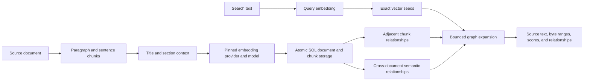

# Chunking and GraphRAG

The graph API turns documents into cited text chunks, embeds them using OpenAI
or Voyage AI, and creates relationships for graph-augmented retrieval. All
documents, chunks, vectors, and edges remain visible through ordinary SQL and
the console's Data workspace.



Automatic semantic edges mean cosine similarity. They do not assert facts such
as authorship, causality, or agreement. Applications can add their own directed,
labeled relationships using SQL. This implementation provides chunk-level graph
retrieval; it does not extract entities, generate community summaries, or call a
language model to answer the question.

## Configure the embedding space

Configure a provider in the console's **Settings**, or use the
[embedding settings API](EMBEDDINGS_AND_ADMIN.md). Keep API keys on the server.
If authentication is enabled, add `-H 'Authorization: Bearer YOUR_TOKEN'` to
each example below.

Create a collection from the current provider, model, and output dimensions:

```sh
curl http://127.0.0.1:8080/v1/graph/collections \
  -H 'Content-Type: application/json' \
  -d '{"name":"knowledge","semantic_neighbors":3,"semantic_threshold":0.8}'
```

The collection pins the provider, model, dimensions, and context format version.
Both document and query embedding requests must match that profile. Changing
server settings to another model does not silently reuse incompatible vectors:
restore the collection's settings or create and populate a new collection.
Equal dimensions are insufficient to establish embedding compatibility.

Collection names contain at most 48 ASCII letters, digits, or underscores,
start with a letter, and are normalized to lowercase. The response reports the
profile, catalog revision, counts, and four managed table names:

| Table | Stored data |
| --- | --- |
| `graph_knowledge_config` | Embedding profile and relationship settings |
| `graph_knowledge_documents` | Original text, title, source, metadata, chunking configuration |
| `graph_knowledge_chunks` | Stable chunk IDs, ordinal, source offsets, text, embedding input, profile, vector |
| `graph_knowledge_edges` | Directed endpoints, relationship kind, weight |

Scalar indexes support document lookup and outgoing/incoming edge lookup.
Collection creation is atomic; existing table names are never overwritten.

## Add structured document fields

In the console, use **Data → Create → RAG collection** and add optional fields.
The API accepts the same schema through `document_columns`:

```json
{
  "name": "manuals",
  "document_columns": [
    {"name": "product_id", "data_type": "INTEGER", "nullable": false},
    {"name": "category", "data_type": "TEXT"},
    {"name": "published", "data_type": "BOOLEAN"}
  ]
}
```

Send this body to `POST /v1/graph/collections`, then provide values in each
document's existing `metadata` object. Up to 32 fields are supported, using
`TEXT`, `INTEGER`, `DOUBLE`, or `BOOLEAN`; names match
`[a-z][a-z0-9_]{0,47}` after lowercasing. Built-in document column names are
reserved. Fields are nullable and non-unique by default; use `nullable: false`
and/or `unique: true` when appropriate. Missing nullable fields become null.
Invalid types, missing required fields, and duplicate unique values fail
before embedding and are checked again at commit.

Declared fields live only in appended, indexed columns of the documents SQL
table. Undeclared metadata remains JSON. API responses merge both sources, so
SQL updates to a declared field are immediately reflected in document,
retrieval, and graph metadata. Existing collections continue to work unchanged.
Schemas are defined at collection creation; adding fields later is not yet
exposed as a collection migration API.

Use SQL joins to filter chunks by document fields or link documents to ordinary
tables. See [structured data and relationships](STRUCTURED_DATA.md). These
filters are explicit SQL queries; the `/retrieve` endpoint does not yet accept
custom document-field filters or traverse named cross-table relationships.

## Preview chunks without calling a provider

```sh
curl http://127.0.0.1:8080/v1/graph/chunk \
  -H 'Content-Type: application/json' \
  -d '{
    "title":"Storage handbook",
    "text":"# Durability\nAcknowledged writes are synchronized to the WAL.\n\n# Recovery\nRecovery replays complete committed records.",
    "chunking":{"max_characters":1200,"overlap_characters":150,"max_chunks":256}
  }'
```

Each preview includes verbatim `text`, zero-based `ordinal`, inclusive
`byte_start`, exclusive `byte_end`, optional `heading`, and the exact
`embedding_text` that ingestion will send. Byte offsets reference UTF-8 source
bytes, not JavaScript string indices. Encode the original source as UTF-8 before
slicing by these offsets.

Splitting prefers paragraph boundaries, then sentence endings, then whitespace,
with a Unicode character split for long unbroken text. Markdown ATX and Setext
headings start new sections; heading-like text inside fenced code is ignored.
Requested overlap is an upper bound, capped at half the preceding chunk and
reduced at word boundaries. Overlap does not cross a heading boundary.
Whitespace-only chunks are omitted from the graph API; meaningful source text
is preserved. The Rust `chunking::chunk_text` function also exposes the original
whitespace-only ranges when a caller needs complete character coverage.

Lengths count Unicode scalar values, **not model tokens**. Defaults are 1,200
characters and up to 150 overlapping characters. The embedding input adds a
bounded title and section heading before each chunk; stored chunk text and
citations remain verbatim. The format is versioned so context changes cannot
silently mix embedding spaces.

The graph API conservatively limits each complete embedding input to 8,191
UTF-8 bytes, including its context, and all inputs together to 1 MiB. Oversized
chunks fail before any provider call. Reduce `max_characters` or context for
oversized individual chunks; reduce overlap or document size for the aggregate
limit.
Provider batches retain explicit dimensions, check every returned vector, and
respect input and aggregate budgets. Voyage uses `input_type: document` for
chunks, `input_type: query` for search, and disables truncation. OpenAI has no
separate retrieval-role parameter. See the official
[OpenAI input limits](https://developers.openai.com/api/reference/resources/embeddings/methods/create)
and [Voyage retrieval parameters](https://docs.voyageai.com/docs/embeddings).

## Ingest and replace documents

```sh
curl http://127.0.0.1:8080/v1/graph/collections/knowledge/documents \
  -H 'Content-Type: application/json' \
  -d '{
    "id":"storage-handbook",
    "title":"Storage handbook",
    "source":"handbook/storage.md",
    "text":"# Durability\nAcknowledged writes are synchronized to the WAL.\n\n# Recovery\nRecovery replays complete committed records.",
    "metadata":{"team":"platform"},
    "chunking":{"max_characters":1200,"overlap_characters":150,"max_chunks":256}
  }'
```

All embeddings are generated and validated before the database changes.
Ingestion normalizes vectors, stores the original document and contextual
embedding inputs, connects adjacent chunks in both directions, and searches
for up to `semantic_neighbors` nearest chunks in **other documents**. Similarity
links pass the collection's cosine threshold and are stored in both directions.
Excluding same-document chunks prevents overlapping passages from consuming
the semantic-neighbor budget.

New chunks are compared against the current collection; existing pairs are not
rebuilt on every upload. Incoming mirrored links mean a popular chunk can have
more than `semantic_neighbors` total edges. Changing a document removes its old
chunks and all incident edges, then generates its new relationships atomically.
Unrelated relationships remain intact. Stable chunk IDs combine the document
ID and ordinal; byte ranges and content may change when that document changes.

Repeating an unchanged upload returns `unchanged: true` without calling the
provider. A stored corruption fingerprint binds document context to its chunk
content and vector values; detected SQL edits invalidate this shortcut so an
upload can repair the chunks. The fingerprint is an integrity check, not an
authentication mechanism. Changing only metadata updates its canonical SQL
fields and free JSON while preserving chunks, embeddings, edges, and the
keyword cache. The response reports `embeddings_reused: true` and zero token
usage; an identical replay also reports `unchanged: true`. This path works
without provider credentials when the existing chunks pass the integrity check.
Changing text, title, source, or chunking settings triggers replacement.
Known-invalid inputs and limits are checked
before generation, including a conservative allowance for new relationships.
Provider errors, invalid vectors, or commit errors leave the old document and
its graph intact. The successful response includes chunk count, directed edges
created, revision, replacement status, and provider token usage.

Ingestion captures the **database-wide** catalog revision before provider work.
If any write commits meanwhile, the final commit returns HTTP 409 with
`stale_revision`; it never overwrites intervening data. An optional
`expected_revision` can reject an already-stale upload before embedding.
Provider calls are not automatically retried, and a failed final commit may
still have incurred embedding usage. Serialize writes while loading a collection
if you want to avoid this conservative conflict behavior.

## Search vectors and follow relationships

```sh
curl http://127.0.0.1:8080/v1/graph/collections/knowledge/search \
  -H 'Content-Type: application/json' \
  -d '{
    "text":"How are committed writes recovered?",
    "seed_limit":3,
    "max_hops":1,
    "neighbor_limit":8,
    "max_results":12
  }'
```

The server embeds the question in the pinned space, finds exact cosine-ranked
seeds using the SQL vector executor, then expands a bounded graph neighborhood.
Seeds stay first. Adjacent passages have priority during expansion, followed by
weighted semantic or application-defined relationships. Every hit reports:

- `chunk_id`, `document_id`, title, source, and metadata;
- verbatim text and `start_byte` / `end_byte` citation offsets;
- its actual cosine similarity to the query;
- `seed` and graph `depth`, distinguishing direct matches from added context.

The response also returns bounded relationships among the selected chunks,
including links between seeds, and `truncated` when a traversal/edge budget
omits eligible work. Cycles cannot duplicate hits. `max_hops: 0` returns only
vector seeds; relationships among those seeds can still be returned. Searching
an empty collection returns no hits without calling a provider.

Use these hits and citation identifiers as context for your answering model.
Overlapping source ranges may repeat text; the offsets let your application
merge neighboring ranges before constructing its final prompt. The server does
not claim that graph context is equally relevant to every direct vector match.

## RAG retrieval and reranking

Use `POST /v1/graph/collections/{collection}/retrieve` for the complete retrieval
pipeline. The existing `/search` endpoint keeps its vector-seed behavior.

```sh
curl http://127.0.0.1:8080/v1/graph/collections/knowledge/retrieve \
  -H 'Content-Type: application/json' \
  -d '{
    "text":"How should I recover from a full write-ahead journal?",
    "candidate_limit":40,
    "seed_limit":12,
    "max_results":10,
    "max_hops":1,
    "neighbor_limit":8,
    "direction":"outgoing",
    "min_weight":0,
    "vector_weight":1,
    "lexical_weight":1,
    "reranker":"local",
    "diversity":0.3,
    "max_per_document":3,
    "max_context_bytes":24000
  }'
```

The stages are:

1. Retrieve semantic vector matches and lexical BM25 matches from the collection.
   Lexical matching helps preserve exact identifiers, names, and error codes.
2. Combine their ranks using weighted reciprocal rank fusion, then expand
   eligible relationships with a bounded beam: rank new context by link strength
   and query relevance, merge proposals from all passages in each hop, and only
   then apply the global candidate-width limit.
3. Optionally score each query/candidate pair with a Voyage cross-encoder.
4. Select whole chunks using maximal marginal relevance, source-overlap and
   duplicate suppression, a per-document cap, and a context byte budget.

Expansion combines decayed path strength with the target passage's cosine or
BM25 query match. Structural path strength stays separate from query fit, so a
weakly matching bridge can lead to useful context. Stronger paths found later
can improve a candidate; zero-weight links contribute no retrieval evidence.
When the seed budget permits, part of the candidate pool is reserved for graph
context. Each hop retains at most `candidate_limit` frontier passages, after
the per-passage `neighbor_limit` is applied. Stable chunk IDs break score ties.
These bounds make traversal selective, not an exhaustive graph search.

`direction` selects `outgoing` (the default), `incoming`, or `both`. Optional
`kind` selects one exact stored label, such as `supports` or `semantic`;
`min_weight` accepts a finite inclusive threshold from 0 to 1. Kind and weight
are checked before links are combined or consume neighbor slots, and also
filter returned edges. Direction controls traversal; returned arrows retain
their stored orientation. Direct vector/BM25 matches remain eligible regardless
of these relationship filters. For example, add `"direction":"incoming"`,
`"kind":"references"`, and `"min_weight":0.6` to find context that references
your strongest matches. This is a retrieval policy, not a document-access filter.

A traversed bridge can be omitted from the candidate pool or final context.
The top-level `edges` still describe only links among selected hits. A graph-
derived hit now also includes `retrieval_path` with `seed_chunk_id` and up to
three `edges` in traversal order. These preserve the retained route even when
its starting or intermediate passages are absent from the final context. Walk
from the seed through either endpoint of each stored edge; an incoming step
follows its arrow in reverse. The hit's `depth` is the retained route length,
which can increase when a stronger route replaces an earlier weak one. Direct
hybrid hits omit `retrieval_path` and keep depth zero. Paths describe discovery,
not factual inference or every explored alternative.

Path evidence is copied from the same snapshot as the hits before external
reranking. It contains identifiers and relationships, not extra passage text;
the UTF-8 context budget still counts only the returned source passages.
Subsequent graph edits cannot change that response's paths. These rules apply
to `/retrieve`; `/search` retains its existing vector-seed traversal.

The embedded Rust API retains `graph_rag_candidates(request)` with the outgoing
default. Use `graph_rag_candidates_with_traversal(request, GraphRagTraversal {
direction, kind, min_weight })` for an explicit policy. Both synchronous and
asynchronous Python collection clients accept these same keyword arguments.

`diversity: 0` keeps relevance order; larger values trade relevance for less
repeated context. The default is `0.3`. `max_context_bytes` counts returned chunk
text in UTF-8 bytes; source labels, JSON, and your answering-model prompt need
additional space. A chunk that cannot fit is skipped rather than shortened,
so its stored text and citations remain exact. Fewer than `max_results` hits
can be returned when these constraints exclude candidates.

Each hit retains its source citation and cosine `similarity`, and adds
`lexical_score`, `fusion_score`, optional `rerank_score`, and `selection_score`.
These scores have different meanings and are not calibrated probabilities.
The response includes `candidate_count`, `context_bytes`, the catalog revision,
`lexical_cache_hit`, embedding usage, and reranking method/model/token usage.
Edges connect only returned hits. Candidate text, vectors, scores, and citations
come from one owned snapshot; a write during the external rerank cannot replace
individual citations with newer data.

The lexical index is cached by collection and chunk-storage generation. Chunk
inserts, text updates, deletes, replacement, and table recreation invalidate it,
including changes through SQL or the typed API. Relationship edits and writes
to unrelated tables keep it reusable; citation data still comes from the current
snapshot. Reopening a database starts with a cold cache. Repeated retrieval
reuses tokenization, posting lists, and precomputed BM25 length factors with
unchanged scoring arithmetic. Index construction borrows already-lowercase
ASCII terms and owns a vocabulary key only once, reducing allocations for
repeated words. Other terms retain the same Unicode lowercasing, including
multi-character mappings; oversized-index fallback uses the same normalization.
The tokenizer uses Unicode word-like terms rather
than model tokens; this is not language-specific stemming or full linguistic
analysis. RRF and MMR
follow the approaches described in the original
[rank-fusion paper](https://research.google/pubs/reciprocal-rank-fusion-outperforms-condorcet-and-individual-rank-learning-methods/)
and [diversity-reranking paper](https://aclanthology.org/X98-1025/).

### Optional Voyage cross-encoder

Configure **Settings → Reranking**, or use `PUT /v1/settings/reranking` with
`model`, `api_key`, `timeout_seconds`, and `max_concurrent_requests`.
`VOYAGE_API_KEY` supplies the initial key at server startup. Reranking settings
are separate from embedding settings, so OpenAI embeddings can use Voyage
reranking. Runtime credentials are write-only and are not persisted; non-secret
settings persist when the server uses a data directory.

Supported models are `rerank-2.5` (default) and `rerank-2.5-lite`. Set
`"reranker":"voyage"` in the retrieval request to opt in. This sends the query
and candidate embedding text, including title/section context, to Voyage.
Local reranking sends no additional document text to a reranker; query embedding
still uses the configured embedding provider.

The provider request disables truncation and automatic retries. The service
validates complete, unique response indexes and finite scores before applying
any ranking. Missing credentials, invalid inputs, rate limits, and provider
failures are explicit errors; there is no silent fallback to local ranking.
A reranking failure can occur after query embedding has incurred usage.

Conservative UTF-8 byte limits reserve tokenizer overhead: queries at most
7,872 bytes, each query/document pair plus 128 bytes at most 32,000, and the sum
of all pairs plus their reserves at most 600,000. These are admission bounds,
not token estimates. Large candidate sets can exceed the aggregate budget;
reduce candidate count or query length. Provider limits and semantics are
specified in the [Voyage reranker API](https://docs.voyageai.com/reference/reranker-api).

| Retrieval setting | Default | Limit |
| --- | ---: | --- |
| Candidate pool | 40 | 1–100 |
| Fused seeds | 12 | 1–20, no more than candidates |
| Returned chunks | 10 | 1–100, no more than candidates or server row limit |
| Graph hops | 1 | 0–3 |
| Neighbors per expanded chunk | 8 | 1–32 |
| Relationship direction | `outgoing` | `outgoing`, `incoming`, `both` |
| Relationship kind | Any | One exact label: `[a-z][a-z0-9_]{0,63}` |
| Minimum relationship weight | 0 | Finite value in 0–1, inclusive |
| Vector / lexical weights | 1 / 1 | Each 0–10; at least one positive |
| Diversity | 0.3 | 0–1 |
| Chunks per document | 3 | 1–100 |
| Context text | 24,000 bytes | 1–1,048,576 UTF-8 bytes |

Queries can contain at most 256 distinct lexical terms. The lexical cache holds
at most three indexes with a conservative 16 MiB budget each, checked against
retained allocation capacities before caching. An oversized vocabulary uses
exact query-specific BM25 scoring without caching the full index. Index builds
run outside the shared cache lock.

## Explore and edit connections

In **Context and diversity**, retrieval has separate direction, exact-label,
and minimum-weight controls. Starting passages (seeds) are adjustable; suggested
seeds decrease with a small candidate budget so connected context has room.
An explicit seed choice is preserved until **Use suggested seeds** is selected.
Choosing as many seeds as candidate slots can leave no room for new graph hits.
Graph-derived results expose **How this passage was found**, with the starting
seed, original relationship arrows, and links to explore intermediate chunks.
An identifier for an omitted bridge does not imply that its text was returned.

The console's **Connections** workspace includes collection creation, chunk
preview, document ingestion, graph browsing, and RAG search. Nodes represent
chunks and are grouped visually by source document. Select a node in the diagram
or accessible list to inspect its full text, citation range, and relationships.
Choose **Explore connections** on a passage or RAG result to follow its links
across page boundaries. The focused view marks the root, groups passages by hop
depth, and retains arrows for the stored relationship direction. Adjust hop
depth, incoming/outgoing/both directions, and minimum weight; **Back to all
passages** returns to paged browsing. The console requests at most 100 nodes,
500 edges, and eight neighbors per expanded passage, subject to server limits.
Neither paged nor focused exploration calls an embedding or reranking provider.
Type checkboxes hide drawn adjacent, semantic, or custom links; they do not alter
the exploration request. Diagram spacing is for readability, not relevance.
Generated similarity links are suggestions of related content, not extracted
facts. Adding a custom label records the relationship you supply.

Browse without calling an embedding provider:

```sh
curl 'http://127.0.0.1:8080/v1/graph/collections/knowledge/graph?offset=0&limit=100&max_edges=500'
```

Optional `document_id` narrows the node page. The response contains `nodes`,
`edges`, `revision`, `total_nodes`, `total_edges`, and `truncated`. Only edges
between nodes on the current page are returned. Browsing is capped at 200 nodes
and 2,000 edges per request. Valid requested sizes are reduced to the server
response-row limit; the returned `limit` reports the effective node page size.
Paging shows a bounded view of the graph rather than implying that disconnected
pages have no relationships.

To explore across pages, copy a real `chunk_id` from a node or search hit and
replace the placeholder:

```sh
curl --get 'http://127.0.0.1:8080/v1/graph/collections/knowledge/neighborhood' \
  --data-urlencode 'chunk_id=ACTUAL_CHUNK_ID' \
  --data-urlencode 'max_hops=2' \
  --data-urlencode 'direction=both' \
  --data-urlencode 'min_weight=0.5'
```

| Neighborhood parameter | Default | Accepted values |
| --- | ---: | --- |
| `chunk_id` | Required | Existing chunk ID, at most 1,024 UTF-8 bytes |
| `max_hops` | 1 | 0–3; zero selects only the root |
| `neighbor_limit` | 8 | 1–32 distinct neighbors per expanded node |
| `max_nodes` | 100 | 1–200, including the root |
| `max_edges` | 500 | 0–2,000 |
| `direction` | `both` | `outgoing`, `incoming`, or `both` |
| `kind` | Any | One exact relationship label, such as `semantic` or `references` |
| `min_weight` | 0 | Finite value from 0 to 1, inclusive |

Valid node and edge limits are reduced to the server response-row limit.
The response contains `collection`, `revision`, `root_chunk`, citation-bearing
`nodes` with `depth`, directed `edges`, and `truncated`. Nodes are selected in
breadth-first layers, merging parents before applying the node cap and favoring
stronger eligible links with stable ID tie breaks. Depth is the shortest path
discovered within the requested bounds, not an unbounded shortest-path promise.
`direction` controls which links are followed; returned edges retain their
original direction and include eligible links between already-selected nodes.
Kind and minimum-weight filters apply to traversal and returned edges. The
edge cap keeps the strongest eligible links; `truncated` signals omitted
eligible work. All returned citations and edges share one catalog snapshot.

Add or update a directed relationship using actual chunk IDs and the revision
from the graph response:

```sh
curl http://127.0.0.1:8080/v1/graph/collections/knowledge/relationships \
  -H 'Content-Type: application/json' \
  -d '{
    "expected_revision":CURRENT_REVISION,
    "from_chunk":"ACTUAL_SOURCE_CHUNK_ID",
    "to_chunk":"ACTUAL_TARGET_CHUNK_ID",
    "kind":"explains",
    "weight":0.9
  }'
```

Replace the placeholders before running the example. Repeat with the same
endpoints and kind to update the weight. To remove the link, use `DELETE` on the
same endpoint with the same fields except `weight`. Revisions are database-wide;
a stale edit returns HTTP 409. Links are directed, endpoint-validated, committed
atomically, and visible in the same SQL edge table used by automatic links.

## Inspect and add relationships with SQL

Run these in the SQL console or through `POST /v1/sql`:

```sql
SELECT chunk_id, document_id, ordinal, start_byte, end_byte, text
FROM graph_knowledge_chunks
ORDER BY document_id, ordinal;

SELECT from_chunk, to_chunk, kind, weight
FROM graph_knowledge_edges
WHERE kind = 'semantic'
ORDER BY weight DESC
LIMIT 20;
```

To add a directed application-defined link, copy real chunk IDs from the first
query and supply a unique edge ID:

```sql
INSERT INTO graph_knowledge_edges
  (edge_id, from_chunk, to_chunk, kind, weight)
VALUES
  ('manual-reference-1', 'ACTUAL_SOURCE_CHUNK_ID',
   'ACTUAL_TARGET_CHUNK_ID', 'references', 0.9);
```

Relationship kinds contain 1–64 lowercase ASCII letters, digits, or underscores
and start with a letter. Weights are finite numbers in `[0, 1]`; endpoints must
be distinct existing chunks. Custom links are directed; add the reverse link
explicitly when wanted. `adjacent` and `semantic` are generated kinds. SQL has
no foreign-key enforcement, so malformed or dangling graph links are rejected
when graph retrieval encounters them. Use document ingestion for source/chunk
changes so provenance, embeddings, and incident-edge cleanup stay coordinated.

## Read and delete documents

`GET /v1/graph/collections` lists collections. Use
`GET /v1/graph/collections/knowledge` for counts and the current revision, or
`GET /v1/graph/collections/knowledge/documents/storage-handbook` for original
source and chunking settings.

Delete a document using the current revision from the collection response:

```sh
curl -X DELETE \
  http://127.0.0.1:8080/v1/graph/collections/knowledge/documents/storage-handbook \
  -H 'Content-Type: application/json' \
  -d '{"expected_revision":CURRENT_REVISION}'
```

Replace `CURRENT_REVISION` with the numeric value. Document deletion removes its
chunks and every incoming/outgoing relationship atomically. Ordinary SQL
snapshots and durable data-directory recovery include graph tables. Persistent
graph writes use one existing SQL WAL record per transaction; the WAL format
does not change.

## Bounds and current scope

| Setting | Default | Limit |
| --- | ---: | --- |
| Document source text | — | 1 MiB UTF-8 |
| Chunk characters | 1,200 | 1–8,000 Unicode scalar values |
| Requested overlap | 150 | Below chunk size; effective overlap at most half a chunk |
| Chunks per document | 256 maximum | 1–256 |
| Chunks per collection | — | 10,000 |
| Collection vector elements | — | 32 Mi elements |
| Collection stored text fields | — | 64 MiB |
| Semantic neighbors per new chunk | 3 | 0–16 |
| Semantic threshold | 0.8 | 0–1 cosine similarity |
| Search seeds | 5 | 1–20 |
| Graph hops | 1 | 0–3 |
| Neighbors per expanded hit | 8 | 1–32 |
| Returned chunks | 20 | 1–100, also capped by server response-row settings |

The graph uses exact searches and an in-memory catalog. Semantic link creation
performs at most one exact search per incoming chunk; it is bounded but becomes
more expensive as a collection grows. Graph writes stage a catalog copy and
hold the writer lock while building and committing relationships. This is a
bounded document/graph workflow, not an unbounded graph analytics system or ANN
index. Quality depends on your embedding model, source documents, chunk size,
and similarity threshold. Test with your own questions and citations; no
retrieval-quality claim is inferred from synthetic integration tests.
