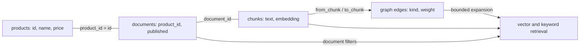

# Structured data, vectors, and relationships

Vectors stores ordinary typed rows, embeddings, and RAG documents in the same
SQL catalog. Use **Data → Create** to choose a structured table or a RAG
collection. Both use the same field editor. A collection additionally manages
source text, chunking, embeddings, and chunk relationships.

These PostgreSQL-style tables are stored by Vectors itself, in one catalog with
the graph. Connecting a separate PostgreSQL server requires importing its data;
there is no live PostgreSQL connector or wire-protocol compatibility.



## Give documents a schema

Create a collection with optional document fields:

```sh
curl http://127.0.0.1:8080/v1/graph/collections \
  -H 'Content-Type: application/json' \
  -d '{"name":"manuals","document_columns":[
    {"name":"product_id","data_type":"INTEGER","nullable":false},
    {"name":"category","data_type":"TEXT"},
    {"name":"published","data_type":"BOOLEAN"}
  ]}'
```

If authentication is enabled, add your bearer token to these requests.
Collection creation uses the configured embedding profile and does not call
the provider. Configure the key in **Settings** before ingesting new text.

Document fields support `TEXT`, `INTEGER`, `DOUBLE`, and `BOOLEAN`. Up to 32
fields are allowed; names are normalized to lowercase and must match
`[a-z][a-z0-9_]{0,47}`. Built-in document column names are reserved. Fields
default to `nullable: true` and `unique: false`.

Provide field values in the existing document metadata object:

```json
{
  "id": "widget-manual",
  "title": "Widget maintenance",
  "text": "Replace the filter every six months.",
  "metadata": {"product_id": 7, "category": "maintenance", "published": true}
}
```

Send this to `POST /v1/graph/collections/manuals/documents`. Required fields,
scalar types, and unique values are validated before embedding, then again
atomically when the document commits. Missing nullable fields become null.
Declared metadata is stored once in indexed SQL columns of
`graph_manuals_documents`; other metadata stays in its JSON column. API readers
merge both sources, so SQL field edits are visible immediately.

Re-uploading unchanged text/context/chunking with only metadata changes updates
the document without regenerating vectors or replacing chunk relationships.
The response includes `embeddings_reused: true` and zero embedding token usage.
Use `expected_revision` to guard an edit against intervening writes.

## Connect different kinds of records

For example, create an ordinary product table through the field editor or SQL:

```sql
CREATE TABLE products (id INTEGER PRIMARY KEY, name TEXT NOT NULL, price DOUBLE);
INSERT INTO products VALUES (7, 'Widget', 29.50);
```

In **Data → Relationships**, name a link from
`graph_manuals_documents.product_id` to `products.id`. The picker offers fields
with the same scalar type. **Open SQL** prepares the join in the existing SQL
workspace; you can edit projections and filters before running it.

The same workflow is available through the API. First request
`GET /v1/relationships` for the current database-wide `revision`, then send:

```json
{
  "name": "manual_product",
  "source_table": "graph_manuals_documents",
  "source_column": "product_id",
  "target_table": "products",
  "target_column": "id",
  "expected_revision": 12
}
```

Use your actual revision in `POST /v1/relationships`. The response contains the
saved `relationship` and its committed `revision`. Creation reuses or creates
HASH indexes on both endpoints in the same atomic transaction as the
definition. Duplicate names or directed field pairs are rejected; a stale
revision returns HTTP 409 without partial changes. At most 256 definitions are
supported, with names matching `[a-z][a-z0-9_]{0,47}` after lowercasing.

Definitions live in the ordinary `_vectors_relationships` table and survive WAL
recovery and snapshots. List responses mark a link invalid if a referenced table
or column disappears or changes type. To remove a definition, send
`DELETE /v1/relationships/manual_product` with `{"expected_revision": 13}` using
the current revision. Records and lookup indexes remain intact.

Links describe equality between shared values. They support one-to-many and
many-to-many matches, but do not enforce foreign keys, cascade deletes, or
require every source value to have a target. A nullable field does not match
another null. Chunk-to-chunk semantic and labeled graph edges remain available
in **Connections**; named table links do not automatically extend `/retrieve`
or `/neighborhood` traversal.

## Query structured data and vector scores together

Get product details alongside document fields:

```sql
SELECT d.document_id, d.title, p.name, p.price
FROM graph_manuals_documents AS d
LEFT JOIN products AS p ON d.product_id = p.id
WHERE d.published = TRUE
ORDER BY d.title
LIMIT 100;
```

Rank chunks while filtering on document fields:

```sql
SELECT c.chunk_id, c.text, d.title, d.category,
       cosine_distance(c.embedding, $1) AS distance
FROM graph_manuals_chunks AS c
INNER JOIN graph_manuals_documents AS d ON c.document_id = d.document_id
WHERE d.category = $2 AND d.published = TRUE
ORDER BY distance
LIMIT 10;
```

Pass `parameters: [query_vector, "maintenance"]` in the `POST /v1/sql` JSON body,
or `params=[query_vector, "maintenance"]` to the Python client's `execute` method.
The query vector must use the collection's model and dimensions.

Connect the entire path in one snapshot-consistent SQL query, including business
constraints and exact vector scores:

```sql
SELECT c.chunk_id, c.text, d.title, p.name, p.price,
       c.embedding <=> $1 AS distance
FROM graph_manuals_chunks AS c
JOIN graph_manuals_documents AS d ON c.document_id = d.document_id
JOIN products AS p ON d.product_id = p.id
WHERE d.published = TRUE AND p.price <= $2
ORDER BY distance
LIMIT 10;
```

Here the parameters are `[query_vector, 50.0]`. Use a `LEFT JOIN` for products
when documents without a matching business record should remain in the result;
a subsequent `WHERE` predicate on a null product still follows SQL null rules.
Aliases, qualified wildcards, scalar expressions, residual `ON` conditions,
`WHERE`, `DISTINCT`, ordering, and `LIMIT`/`OFFSET` share the existing evaluator.
Unqualified ambiguous columns are rejected; qualify them with a table alias.
`LEFT JOIN` retains unmatched left rows with null right-side values.

Joins reuse a maintained right-side HASH, PRIMARY KEY, or UNIQUE index when the
key types match; otherwise they build a temporary lookup. Row pairs are streamed
into the existing bounded result/ranking machinery. Chains borrow row values without
copying embeddings or materializing all intermediate matches. A small result
limit avoids retaining the full join output, but ordered queries may still
examine every matching pair. A large many-to-many match can therefore remain
expensive.
`DISTINCT` additionally tracks seen result values, so its working set can grow
with the number of unique results even when the final output is limited.

SQL supports chains of up to 16 tables with `INNER` and `LEFT` joins. Each `ON`
must contain a scalar equality between an earlier table and the newly joined
table; additional conditions are allowed. An `ON` cannot refer to a later table.
The executor follows written join order; place selective tables early when
possible. `rows_examined` counts candidate probes and unmatched left-row
extensions across stages. Aggregate joins, `USING`, `NATURAL`, `RIGHT`/`FULL`,
non-equijoins, subqueries, and join `EXPLAIN` remain unsupported.

## Scope GraphRAG retrieval by document fields

In **Connections**, expand **Filter documents** in the retrieval controls, add
a field, and choose its comparison and value. Conditions combine with AND.
Use **Is empty** or **Has a value** for nullable fields. Filter drafts are kept
separately for each collection; the result summary records the filters used for
that retrieval. These controls use the collection's declared field types.

The hybrid `/retrieve` endpoint accepts `document_filters` with the same
`column`, `operator`, and `value` shape as structured vector search:

```python
result = db.collection("manuals").retrieve(
    "How often should I replace the filter?",
    document_filters=[
        {"column": "product_id", "operator": "eq", "value": 7},
        {"column": "published", "operator": "eq", "value": True},
    ],
    candidate_limit=40, max_results=10, max_hops=2,
)
```

Up to 32 predicates are combined with AND, using canonical typed document
columns (including built-ins such as `document_id`, `title`, and `source`).
Operators are `eq`, `ne`, `gt`, `gte`, `lt`, and `lte`. Null values support only
`eq`/`ne`, interpreted as `IS NULL`/`IS NOT NULL`; ordered comparisons against
null fail. Filter text is limited to 65,536 UTF-8 bytes and cannot contain NUL.
Free-form JSON metadata is not queried as nested fields; declare searchable
fields when creating the collection.

Eligibility is applied before vector and keyword top-k, and before each graph
neighbor budget. Excluded documents cannot become hits, graph bridges, or path
evidence. Filtering all records out returns an empty result. BM25 statistics
remain collection-wide, allowing the existing keyword cache to be reused across
different filters. Schema and types are checked before embedding generation
and rebound to the actual retrieval snapshot afterward, so SQL field changes
take effect immediately without re-embedding documents.

These filters scope one retrieval request; authentication remains database-wide.
The simpler `/search` and graph browsing APIs retain their existing behavior.
For conditions on another table, use an explicit SQL join as above. Named table
links still do not automatically expand the chunk graph.
